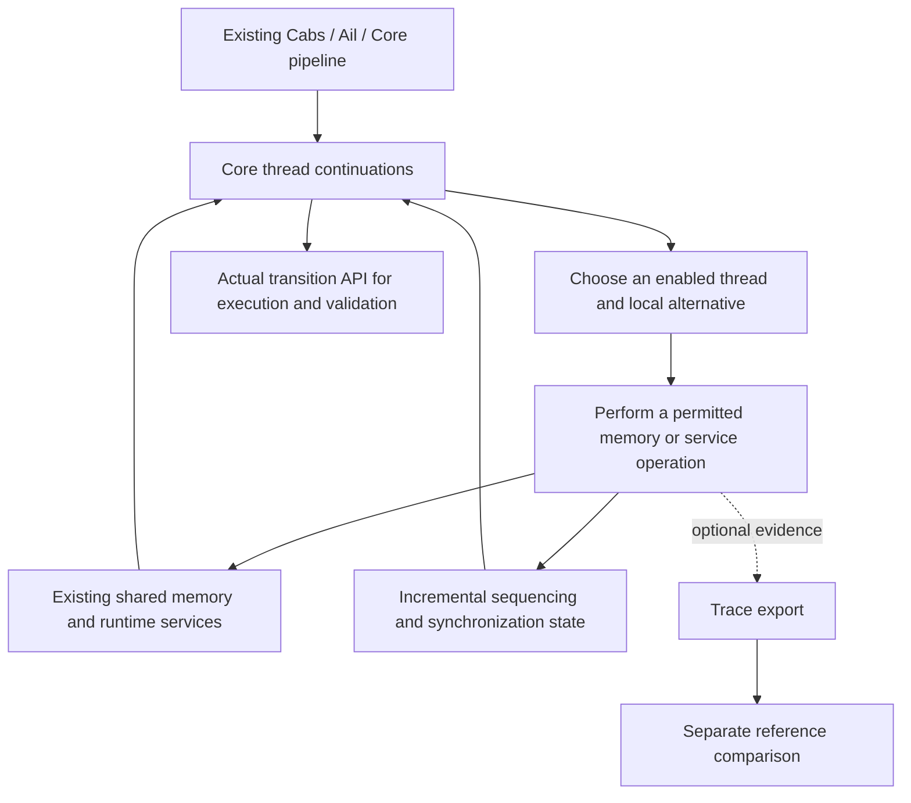

# SC concurrency master plan

Updated 2026-09-29. **This is the governing plan for the SC concurrency
build**: objective, work order, acceptance criteria, current status and
landing policy. Detailed designs and slice records support it; they do not
silently change it. Status is in §6.

## Summary (plain language)

**Goal.** Add a sequentially consistent (SC) concurrency mode to the
existing Cerberus semantics: threads take turns, one Core step at a time,
over the existing C memory model, with data races detected as undefined
behaviour. It is shared through Lem (so the OCaml oracle and the Lean port
run the same definitions) and usable from Lean. Iris integration is
separate, later work.

**History.** Two earlier attempts (`feature/concurrency`, then
`arc/sc-prototype`) failed; [USER 2026-09-24] ruled the prototype failed.
Designs from them that are rejected here (§5): admitting executions by
checking an accumulated execution graph at run time, restricting shared
scalars to a single writer, and suppressing race findings after an
interpretation gap. The old branches are a source of test cases and
candidate code, re-checked piece by piece, never merged.

**Where we are (2026-09-29).**

- *Landed:* WP0, passive "receipts" recording what each existing memory
  load/store did (mainline `5ecc0aa33`). No concurrency yet.
- *Decided:* WP1 chose how to build execution (below) using experiments
  (a restricted stepper in shared Lem plus a Lean-only test adapter that
  supplied the SC features). Its decision record lands as a document; its experimental
  code does not ([USER 2026-09-29], see the
  [assessment and rulings](lean_frontend/docs/2026-09-29_sc-assessment-and-rulings.md)).
- *Not started:* S1, the first real SC execution code.

**How execution will work (the WP1 decision).** A scheduler repeatedly picks
one runnable thread and runs one Core reduction step for it against the
current shared memory. A read-modify-write (`SeqRMW`) is split into its
read, update and write; other threads may run between them, but the thread
that started it cannot interleave its own unrelated work there. Program
order (what C sequences before what) is tracked separately from the order in
which the scheduler happened to run things, and races are checked
incrementally against a bounded summary of what is still relevant, not
against the whole history.

**What is next.** S1: one bounded step function in shared Lem, built fresh
from mainline. It mirrors upstream's fork/join behaviour and refuses loudly
where upstream refuses ([USER 2026-09-29]). S1 starts now; it does not wait
for the main-line track's bug hunt. Overlap with that track is handled by
announcing claims in the shared register (§6).

**Hardest open problems.** (1) Recovering C's sequenced-before order from
Core, where memory effects do not always occur in source order (see
*negative action* below), and building the inter-thread race check on it. (2) Proving
that every execution the SC reference model allows is reachable by the
scheduler, including when a read value changes later control flow.

## Terms used in this plan

- **Receipt**: WP0's record of one actual memory operation (arguments,
  result, failure-time state), attached to the returned state.
- **Pending operation**: a source operation, such as `SeqRMW`, that has
  performed some of its memory accesses and is waiting to perform the rest;
  its thread is **owned** by it until it completes or fails.
- **Source order / sb**: C's sequenced-before relation between a thread's
  actions; **hb** is happens-before, which adds synchronization.
- **Negative action**: a Core memory action of polarity `Neg`, which
  `core.lem:152-154` defines as "only sequenced by letstrong" (a `Pos`
  action is sequenced by both `letweak` and `letstrong`). Assignment and
  postfix increment/decrement stores are elaborated this way
  (`translation.lem:762`, `:2485`). Core's reducer may perform a negative
  action away from its written position, recording exclusions so
  intra-thread races are still found; so the order memory effects happen in
  is not source order.
- **Frontier**: the set of already-completed actions that the next action in
  a thread's source continuation is ordered after.
- **Retained summary**: the bounded information kept about past actions
  (frontiers, pending calls/joins, published snapshots, per-location last
  write and unordered reads) that is still needed to detect a future race.
- **Reference model**: the pinned axiomatic model `cmm_csem.lem`
  (`SC_memory_model`), used offline for comparison and proofs, never as a
  runtime admission check.
- **Donor branches**: the failed branches, used as a source of candidate
  code and tests (the "quarry" assessment).
- **F1–F4**: WP0 foundation items in the technical design §6 — F1 observe
  ND nodes without losing state, F2 passive load/store receipts, F3 faithful
  representation access where F2 needs it, F4 later atomic-order validation.
- **Receptiveness**: the executor can follow every read value the reference
  model allows, including the different control flow a different value
  causes; coverage proofs need it.
- **M1 / M2**: the WP1 review's two main findings — M1, changing inherited
  upstream fork/wait behaviour; M2, experiment code placed in shared Lem.
  Both closed by the [USER 2026-09-29] rulings.
- **V1**: the first internal end-to-end real-C SC lane (§2).
- **WP-C**: the correspondence (proof) work that runs alongside S1–S4.

## Directions and provenance

[USER 2026-09-24, paraphrased; no verbatim quote recorded] Build a master
plan for successful SC concurrency, treat the previous branch as a quarry
for useful machinery, guard against drift during a long build, and seek
early mainline landings whenever work can be audited cleanly; land
necessary, independently validated foundations before choosing the
execution strategy. The milestone and landing decomposition below is
[AGENT] planning under that direction.

[USER 2026-09-25], verbatim (from the
[scope record](lean_frontend/docs/2026-09-25_sc-semantics-mvp-scope.md)):
"we do not try to land an Iris integration, but instead focus on an MVP
which just builds a coherent and correct SC model". This removes the
external consumer demonstration and Iris adoption gates; it retains the
semantic scope, correctness, scale and reference obligations below and does
not adopt the first review's narrower C profile.

[USER 2026-09-29] rulings (verbatim in the
[assessment record](lean_frontend/docs/2026-09-29_sc-assessment-and-rulings.md)
§2): WP1 lands as a decision record only and S1 starts fresh from mainline;
S1 mirrors upstream's fork/join behaviour and refuses loudly; the
coordination counterproposal is accepted with one amendment, and S1 does
not wait for the main-line bug hunt; this plan lands on mainline; one fresh review inside
the L0 pre-merge audit; lighter per-slice records.

The [re-review](lean_frontend/docs/2026-09-25_sc-concurrency-plan-rereview.md)
accepted the finite WP0, early feasibility experiments and explicit
correspondence work; another broad planning pass is not required.

## 1. What we are building and where it fits

Build an operational, executable SC concurrency instance of **the existing
Cerberus semantics**, shared through Lem and usable from Lean. Core continues
to evaluate C; the concrete memory model continues to determine values,
representations, provenance and validity. Concurrency controls how actual
thread continuations advance against shared memory and services, which
operations are indivisible, and how C sequencing, synchronization and races
are interpreted. Expose the actual transition definitions and observations
in Lean; integration with reasoning frameworks is separate work.

Cerberus already has Core thread states, action requests with result
continuations, structured parallel expressions and wait states. Its historic
C11 machinery adds symbolic execution and a separate commitment process over
execution graphs. That integration is currently incomplete. We reuse the
existing request/driver/memory boundaries and reference definitions; restoring
the old weak-memory commitment engine is not a prerequisite for SC.

**[AGENT, WP1 decision] Build selected, bounded Core reductions over current
concrete memory, with explicit owned pending primitives where a source
operation must yield.** Track source sequencing separately from scheduler
order, and use incremental causal/access summaries. The
[decision record](lean_frontend/docs/2026-09-27_sc-wp1-execution-decision.md)
compares the alternatives and binds the S1–S4 obligations below (its
experimental code stays on `arc/sc-wp1` `186392a53`; see its banner). No
public SC support exists:

The architecture has the following fixed constraints, irrespective of the
WP1 execution decision:

1. Runtime progress, values, existing faults and final results must not depend
   on reconstructing or checking an axiomatic execution graph. Disabling trace
   export preserves semantics, including race checking.
2. Reuse the existing evaluator and object memory. Shared semantic changes live
   in `.lem`; handwritten OCaml/Lean seams remain paired. No second byte store,
   parallel C evaluator or Iris-only mirror executor.
3. Scheduler order does not create C happens-before. Preserve Core's partial
   source sequencing, including unsequenced expressions and calls. A single
   monotonically increasing clock per C thread is not a sufficient design.
4. Concrete byte ranges, C memory locations and atomic object identity serve
   different purposes. Ordinary ordered byte/member operations must work;
   failure of a scalar projection cannot become a language restriction.
5. Preserve completed effects and primary failures. The initial executor stops
   at the first justified UB or unsupported operation; post-UB diagnostic
   continuation is a separate later capability. Distinguish normal results,
   UB witnesses, unsupported operations, blocking and exhausted resources.
   A selected safe execution makes no whole-program safety claim.
6. Scale one selected execution early. Exhaustive schedule search remains
   combinatorial and is a separate concern; raising limits does not repair
   history-dependent runtime work.

See the [technical design and literature](lean_frontend/docs/2026-09-24_sc-concurrency-design.md)
for concrete transition contracts, proof obligations, scale probes and WP0
boundaries. WP1 states the source-frontier and retained-endpoint contracts;
the efficient concrete representation remains an S2 acceptance obligation.
The exact materialized matrix is a proof/measurement baseline with O(R²)
retained cells, not a large-program performance claim.

## 2. Completion means a usable, justified semantics

The target instance includes non-atomic accesses, `seq_cst` atomics and atomic
updates, strong/weak CAS, SC fences, initialization, structured Core fork/join,
and ordinary concrete objects and supported runtime operations. Weak orders
are explicitly outside this instance and are never silently strengthened.
Pthreads, general weak memory, fairness guarantees, partial-order reduction,
a general filesystem port and all Iris integration are separate work. No Iris
experiment, package adoption or compatibility proof is an MVP prerequisite.

SC is complete only when the following claims have evidence against the actual
shipped definitions. Intermediate mainline landings may satisfy smaller,
explicit contracts; they do not imply this completion claim.

| Completion obligation | Required evidence |
|---|---|
| **Executable integration** | Real C elaborates and runs through initialized Core, shared memory, thread creation/join, saved services and finalization. Actual bounded steps return control even on a deterministic singleton path; choice discovery has no unchosen effects. Step and runner laws account for the same state, events and remaining resources. Helper resumption uses current shared state. |
| **C sequencing, synchronization and races** | An exact monitor on the declared domain, with justified summary invariants and first-race preservation; unsequenced/weak/strong source boundaries, publication, fork/join and independent conflicts are covered. No global suppression of findings after an unrelated gap. |
| **Atomic semantics and C surface** | Operation-specific order validation, initialization, indivisible RMW/CAS phases, failed-CAS expected writeback, weak spurious failure and fences work through the actual frontend/runtime. Unsupported weak orders and preprocessing configuration receive honest treatment. |
| **Concrete objects and services** | Ordered byte updates, initialized members, aggregate copies, disjoint locations, overlapping accesses, helpers, lifetime and relevant library effects compose correctly. Sequential behavior is preserved, apart from separately justified corrections. Stream/internal-state protection is modeled or precisely reported as a runtime gap. |
| **Reference justification** | Execution fidelity, scalar trace soundness and coverage, UB/prefix policy, and object conservativity are separately established. Pin the exact predicates and hypotheses; connect proofs and bounded complete-set comparisons to production handlers. A finite comparison is evidence, not a general equivalence theorem. |
| **Scale** | SC scheduler/monitor/receipt overhead is independent of discarded execution history at fixed relevant dimensions. The §7 technical-design probes also report whole-run time/RSS and separately attribute inherited trace, lifetime, output and closure costs. Test fixed objects, lifetime churn, repeated source split/join and repeated thread creation. No unqualified whole-machine live-state bound. |
| **Usable observations** | Public output and the API preserve results, failure-time state, retained findings, model gaps and incompleteness. Budgets are explicit; timeout is neither safety nor an empty allowed-outcome set. |
| **Semantic interface** | Actual configurations, transitions and observations are available in Lean, with bounded-runner correspondence and explicit semantic atomicity boundaries, exercised by the production examples. A justified whole-machine relation is sufficient; no Iris-specific thread-pool presentation or external-client example is required. |
| **Release integrity** | Fresh identified artifacts, required repository gates, independent semantic evidence, an audited supported profile and an exact unresolved-obligation list. Backend agreement establishes port evidence, not correctness of their shared semantics. |

The initial axiomatic theorem may have a narrower, explicit scalar domain
than the executable object semantics. The latter needs its own composition
argument; restricting the theorem does not discharge that obligation. WP1
records the theorem/domain schemas and decomposition, including initialization,
fences and source receptiveness; S1–S4 must instantiate and discharge them
against the actual definitions. Completion cannot be obtained by quietly
reclassifying required ordinary behavior as unsupported or replacing a proof
obligation with a passing test suite. A material scope change is a visible
plan revision discussed with the user.

**First executable milestone V1:** before expanding atomic or concurrent
service families, keep one end-to-end lane running through real C on both
backends: initialization/main/finalization, structured fork/join, SC integer
load/store publication and its missing-synchronization control, disjoint
members and a same-location race, an ordered byte update followed by an
independent race, and a deterministic loop under a tiny step budget. The lane
uses actual program entry, transition API, monitor and observation codec.
Record schedule/local choices and classify each case as complete enumeration
or a selected prefix; independently specify its expected observations.

V1 is an internal validation milestone with concrete supported cases, not a
smaller public release or a general C support claim. Unsupported operations on
that path must report unsupported through the actual entry; no sequential
fallback, invented atomicity or refusal disguised as UB. Stop at first UB or
unsupported operation. Keep ordinary ordered helpers available where already
justified; admit concurrent helper families only after their boundary tests.

**WP-C — correspondence, on the critical path:** begins in WP1, alongside the
execution experiment. Its first deliverable is well-typed candidate theorem
statements, nonvacuous example hypotheses and a decomposition into execution
fidelity/erasure, monitor and first-race preservation, scalar soundness,
scalar coverage, and object conservativity. A checked statement is not a proof.
Pin initialization forms and reference predicates at this point; the NA/SC
order restriction alone does not establish the model-domain hypotheses.
Coverage must account for actual Core read-dependent control flow and source
receptiveness. Executable `true` stubs in `cmm_csem.lem` discharge nothing.

At the WP1 checkpoint, also demonstrate a substantive general lemma about the
riskiest link from actual Core transitions to the chosen reference invariant
or linearization argument. A closed-program calculation, definitionally equal
wrapper or theorem assuming the desired reference predicate is insufficient.
Reuse the experiment's production definitions, keep its declared fragment
bounded, and report the hardest unresolved obligation before feature expansion.

*How WP1 met this (2026-09-29 assessment):* only locally. Its lemmas
(`unseq_pairwise`, `hoisting_excludes_prior`) are genuine theorems about
production Core definitions but concern Core's intra-thread unsequenced-race
check, not inter-thread order or the reference model; the correspondence
theorems exist as typed statements only. The link from Core source order to
the reference `sb`, and a race monitor over it, are therefore S2's first
proof obligation, not already-established ground.

WP-C's obligations attach to the responsible S1–S4 changes and name which
production definitions they concern, what is proved, what has only bounded
evidence, and what remains open. V1 supplies an early concrete connection;
S5 cannot waive unproved release obligations. If WP1 cannot give a credible
decomposition, revisit the design or explicitly discuss release scope before
broad implementation. General correspondence is not left for final audit.

## WP1 decision: constraints on the next implementation

[AGENT, WP1 decision, 2026-09-27; accepted by independent review
`1c7e52fad`] The full reasoning is the
[decision record](lean_frontend/docs/2026-09-27_sc-wp1-execution-decision.md).
The constraints it places on S1 onward, as amended by [USER 2026-09-29]:

1. **One step function, in shared Lem.** Execution selects one Core
   reduction of one thread at a time, using the existing Core reducer,
   memory model, call frames, startup and finalization. S1 writes this once,
   in `.lem`, so the OCaml oracle and the Lean port share it. WP1's Lean-only
   adapter and its shared-Lem experiment block are **not** carried forward;
   they are a specification of the behaviour S1 must produce, not code to
   promote. No second evaluator. S1 is therefore a deliberate shared-`.lem`
   change visible to the OCaml oracle, under [USER 2026-09-29] ruling (1).
   The earlier [USER 2026-09-04] brief constraint "we don't change the lem
   structure for ocaml" (recorded in
   [the typed-failure outcomes design](lean_frontend/docs/2026-09-05_typed-failure-outcomes-design.md)
   §0) was the condition WP1's M2 finding cited. Its scope is ruled
   [USER 2026-09-29]: "this is specifically about features that the ocaml
   upstream currently supports, i.e we don't bend the existing trust story.
   But for SC we have to change things because there's no upstream
   support". So S1 may add new shared-`.lem` SC semantics; it must not
   change the behaviour of anything upstream already supports (sequential
   execution stays byte-for-byte on the existing differential lanes, and any
   refactor of existing definitions is behaviour-preserving and shown to
   be). Fork-drift changes are refreshed
   deliberately in `scripts/fork_drift_manifest.txt` with a stated reason;
   code is never placed to avoid that gate.
2. **Read-modify-write.** `SeqRMW` is a load, an update and a store; its two
   accesses are not atomic with respect to other threads, which may run
   between them. While it is pending it owns its thread: no other work of
   that same thread (sibling operand, call) runs in between. The update is
   evaluated against current shared memory, never a saved snapshot. A child
   thread's completion that would rewrite an owned parent waits until the
   ownership ends. Ownership must not invent a sequenced-before or
   happens-before edge.
3. **Nondeterministic choices.** Discovering what can run must not perform
   any effect. S1 carries the primitive nondeterministic alternatives of each
   pending operation (WP1's adapter refused them).
4. **Fork/join mirrors upstream** ([USER 2026-09-29] "mirror and refuse seems
   safest"). S1 keeps upstream's positional fork-result order and upstream's
   `subst_wait_stack ==> Stack_cons2` refusal (from C, reached only through
   Cerberus's non-ISO par-block extension; Core text can also express
   `par` directly). If an SC execution reaches that
   refusal it reports a classified *unsupported* outcome, loudly; it is never
   a silent result or UB. No shared-model divergence, tray draft or
   `shared-model-fix` row is prepared. WP1's Lean-local fork/join repairs are
   not adopted.
5. **Source order is separate from scheduler order.** Track what each
   thread's next action is sequenced after (value-completion and
   all-effects frontiers, including Core's negative actions) and, separately,
   synchronization. The frontier rules (decision record §1): weak
   sequencing transfers the value frontier; strong sequencing transfers all
   completed effects including negative ones; unsequenced operands share the
   incoming frontier, not the preceding scheduler choice; calls and
   fork/join carry their own local-order and synchronization endpoints; a
   publication is an immutable snapshot that retiring its publisher does not
   advance. Retained race-check state is a bounded summary (§ Terms);
   WP1's exact O(R²) matrix is a correctness baseline, and S2 must choose and
   measure a sparse representation against it.
6. **Scale work belongs to S1.** Unbounded retained diagnostic output and the
   temporary-environment growth under negative hoisting (measured in WP1)
   must be fixed in S1 by a streaming output policy and reclamation based on
   what the current frame and continuations can still reach; no
   numeric-symbol cutoff. Thread-churn measurements must be repeated with
   real child runtime allocations (WP1's fixture used a null child errno).
7. **Reference theorem domain.** The initial scalar theorem uses
   `SC_memory_model` / `SC_condition`: atomic initialization before all
   accesses and the reference's same-thread indeterminate-sequencing
   condition; no single-writer restriction. Consistency is not definedness:
   complete coverage requires `each_empty SC_memory_model.undefined X`, a
   valid initial configuration and resources shown adequate for each
   supported finite source path (never defined as "the run succeeded"), and
   yields a completed run. First-conflict prefixes and whole-program UB
   lifting are separate obligations. `SC_condition` excludes fences and
   lifetimes: S3 uses the seq_cst-only restriction of
   `sc_fenced_memory_model` and proves the no-fence agreement; S4 supplies
   object/lifetime conservativity. Upstream's program-level `true` stubs and
   `bigthm` are not used.

Reopen the design if S1/S2 cannot replay read-dependent control flow
(coverage) or cannot recover source order from Core, before broad S3 work.

## 3. Work packages and audit boundaries

Milestones describe evidence, not donor commits or quotas of new code. Reuse
correct mainline behavior unchanged. Subdivide a row whenever a smaller useful
change can pass its own audit. Reference and proof work accompany semantics
throughout; S5 assembles established results rather than starting them.

| Package | Deliverable and dependency | Exit / earliest landing boundary |
|---|---|---|
| **WP0 — necessary foundations** | Close after one paired load/store observation slice with its real diagnostic consumer: load results, same-value writes, returned failure state, ND alternatives and completed-operation prefixes. Reuse existing state transport where sufficient. | Disabled-observer erasure, bounded/drainable receipts, state/choice preservation and operation-proportional capture cost. F1 transport and minimal F2 land together; only F3 needed by this consumer belongs here. **Closed: WP0 accepted and landed at `5ecc0aa33`.** Helper/lifetime/metadata extensions and F4 do not hold WP0 open. |
| **WP1 — execution feasibility and decision** | **Closed as a decision.** Lean-only experiments on `arc/sc-wp1` (`af1342d32`, review response `186392a53`) chose selected Core steps plus owned pending operations, stated source/retention contracts and typed WP-C statement schemas, and proved local Core lemmas. Independent review `1c7e52fad` accepted the decision at feasibility scope. | [USER 2026-09-29] The decision record, review and response land with L0 as documents; the experimental code, tests and evidence stay on `arc/sc-wp1` (M2 closed by not landing them). What the evidence does and does not establish: [assessment](lean_frontend/docs/2026-09-29_sc-assessment-and-rulings.md) §1. |
| **S1 — actual bounded transition API** | Implement the chosen thread/Core alternatives, program continuation, per-owner primitive continuations and observations, including actual child runtime/errno initialization. One step function in shared Lem, cut from then-current mainline; no Lean-only adapter. Mirror upstream's positional fork results and its `Stack_cons2` wait refusal, reporting a classified unsupported outcome where SC execution reaches it ([USER 2026-09-29]). Include initialization/finalization, explicit resource accounting, production output streaming and sound lexical temporary reclamation. Add other services with their first justified concurrent consumer. Depends on WP0/WP1. | Deterministic-loop budget control, effect-free choice discovery, step/run agreement for state/events/resources, `SeqRMW` non-atomicity, nested fork/join, blocking and selected-loop scale. Completion/UB/unsupported/blocked/exhausted are distinct. Internal until semantic acceptance; an observed ND node alone is not a thread step. |
| **S2 — source order and race semantics** | Implement and justify summaries for source sequencing, synchronization and conflicts over S1. Use the minimal SC access/fork/join rules; full atomic operation coverage follows in S3. | Independent relation comparison and summary/first-race arguments; unsequenced expressions, separate members, same-element races, publication and race-before-loop. Recheck scale with the monitor enabled. Land separable summary/monitor units with their actual consumers and precise contracts. |
| **S3 — full atomic operations and C surface** | Minimal real-C load/store/initialization lowering accompanies S1/S2 for V1. After V1, extend to full order validation, RMW/CAS, fences and callable library coverage. Initialization's semantic/reference obligations are decided in WP1. | Keep V1 green through each family; complete bounded production/reference comparisons, a production mutation control, independent SB/MP/CAS expectations and a real linked callable fence. Land validated operation families separately. |
| **S4 — object and runtime composition** | A cross-cutting track over WP0 and the relevant S1–S3 changes. Ordinary objects are exercised from the first handler; helpers, lifetime and precise library protection extend them. | Ordered byte/member/copy cases, helper interference and effects before failure, actual location/lifetime conflicts, ordered library calls and shared-service cases. Land each useful fix separately. Pull needed work forward whenever an earlier gate depends on it; do not postpone object correctness until after atomics. |
| **WP-C — correspondence** | Explicit cross-cutting work over WP1 and S1–S4, with the decomposition above and technical-design §6. | Every release obligation has a precise statement, responsible semantic slice and evidence status. Initial theorem/domain plan precedes broad extraction; discharged obligations accompany code. No automatic transfer from upstream assumptions or bounded comparisons. |
| **S5 — public SC semantics delivery** | Stabilize and document the already executable whole-program API and public mode after S1–S4 and WP-C. | All §2 claims connected to shipped definitions, production V1/extended examples, honest public observations and full applicable release checks. This is the feature-enablement landing, not the first mainline landing or the first step API. Iris adoption is separate. |

WP0 excludes scheduling policy, new suspension constructors, atomic transaction
boundaries, clocks/race algorithms, graph adapters, library-lock policy and a
public SC switch. A demonstrated sequential defect discovered along the way
can be fixed and landed as its own slice. Completing unrelated filesystem
capabilities or redesigning the entire frontend is not a hidden dependency.

Keep three contracts separate: primitive receipts describe actual memory
operations at returned nodes/states; logical C actions carry source sequencing,
location and atomic-operation meaning; scheduler boundaries determine where
another thread may advance. Address/size footprints alone do not determine C
memory locations. Receipts need no sequence of historical memory snapshots.
Draining a helper's receipts after completion does not supply earlier
interleavings or first-internal-race state. Connect observation to justified
suspension before claiming concurrent helper support.

## 4. Land useful work early

**Prepare a landing whenever a completed slice is useful on current mainline
and its contract can be audited independently. Do not accumulate completed
slices merely to produce one eventual concurrency merge.**

The expected landing sequence is:

| Landing | When to propose it | What it claims |
|---|---|---|
| **L0: plan, decision record and diagnostic seeds** | [USER 2026-09-29] "land on mainline seems reasonable". Candidate: branch `docs/sc-l0-20260929` (this plan, its supporting records, the WP1 decision record/review/response and the diagnostic seeds, cut from mainline). Lands after its pre-merge audit, which includes a fresh full review of this plan and the WP1 decision record, and per-merge sign-off. | Governing direction, the execution decision and reproducible failure evidence only; no new runtime support. |
| **L1: first passive effect slice** | As soon as minimal load/store receipts plus any necessary existing-state transport pass their independent audit and sequential checks. | Useful observation of existing memory behavior. No scheduler or public SC. |
| **L2…: subsequent semantic, receipt or sequential fixes** | WP0 has landed. Add helper/lifetime/metadata receipts with the first execution feature consuming them; independent sequential fixes can land when ready. F4 normally accompanies S3. | Exactly the new capability or corrected behavior, without future scaffolding; these are not prerequisites for closing WP0. |
| **Execution decision and internal semantic slices** | WP1's decision can land as documentation. S1–S4 changes land when their stated contracts and dependency boundaries are independently checked. | Audited internal capabilities with real consumers and explicit remaining obligations. Experimental outcomes are not advertised as accepted C behaviors. |
| **Public SC enablement** | S5 and every applicable completion obligation have passed. | The documented SC instance and actual provider interface, with exact supported scope and evidence. |

For each landing:

1. Build a short branch from the then-current `mdd/cerberus-lean`, containing
   only that slice and already landed prerequisites. Once L0 lands this plan
   lives on mainline and changes through small documentation landings;
   `arc/sc-concurrency` becomes a parked record. No long-lived SC branch may
   become an alternate mainline accumulating unaudited features.
   If two changes cannot be validated independently, make their smallest
   coherent combination the landing unit and state why.
2. Prepare **one** short dated acceptance record per landing ([USER
   2026-09-29] agreed to lighter per-slice records; these details are
   [AGENT]): review findings and their
   dispositions go into that record or the review record, not a chain of
   response documents; bulky evidence (JSON dumps, transcripts) stays on the
   slice branch unless a gate reads it, cited by commit. Its contents:
   problem/contract, exact
   base/head, dependencies, donor provenance if any, source of expected
   behavior, checks/proofs, a meaningful failure control, relevant cost,
   sequential effects, and remaining limits. Identify source and built
   artifacts. Reusing a donor test does not adopt its expected answer.
3. Run focused validation and the applicable required repository gates under
   [LADDER.md](scripts/LADDER.md) and
   [VALIDATION.md](lean_frontend/VALIDATION.md). Keep documentation checks
   distinct from runtime certification. No stale generated artifacts or
   baseline changes without an independent explanation.
4. Once the candidate is concrete, propose audit scope/scale and independent
   review to the user. Use the existing [branch policy](CLAUDE.md#branch-roles)
   and workspace pre-merge practice: review
   the actual source/state contract and evidence, resolve findings, and
   obtain explicit sign-off for the exact ff-only mainline landing. This
   planning instruction establishes early landing intent; it is not blanket
   merge or push permission. Do useful preparation before that final ask.
5. If mainline moves, rebase the small candidate, inspect conflicts, rerun
   invalidated checks and renew readiness/sign-off as required. After
   landing, record the mainline commit here and reconcile any dependent work
   already based on its audited candidate. [USER, 2026-09-25, paraphrased] WP1 may proceed
   while the orchestrator handles WP0 landing; the landing sequence does not block
   that investigation. Synchronize the coordination branch without reviving
   accepted or rejected donor patches. Functional Lem changes retain the existing
   Lem-first, re-pin, revalidate landing order.

Do not propose an isolated abstraction with no immediate consumer, a helper
whose correctness assumes unfinished later machinery, or public enablement
that makes incomplete executions look valid. Split or combine such a patch
until the contract is real. This rule enables early useful landings without
weakening semantic acceptance.

## 5. How the old branches are used

`arc/sc-prototype` is a **quarry**, not the implementation base or the project
roadmap. Pinned implementation: `631382a9d23a709112f38add53357d4cbe6fc108`;
documentation-only handoff: `4860f0ef0d20f2a2a4d8d96e6ecfc7b2c99ceed2`.
The older `feature/concurrency` is another source of counterexamples.

The [quarry assessment](lean_frontend/docs/2026-09-24_sc-prototype-quarry.md)
maps candidate machinery to independent acceptance boundaries. Effect capture,
failure-state handling, continuations and atomic lowering may be useful;
none is accepted because the donor called it complete. Extract the minimum
needed, adapt it to current mainline and prove/check its contract afresh.
Rewrite when extraction would preserve the failed architecture. Never merge
or rebase the donor wholesale.

The accumulated-graph admission path, scalar single-writer restriction and
global suppression of races after an interpretation gap are rejected runtime
designs. Offline reference code may be extracted only for its explicit
comparison domain. Old test counts and paired-backend agreement are evidence
to investigate, not approvals.

## 6. Status, next action and drift control

Status is updated with each accepted decision or slice. **Implemented,
validated, independently audited and landed are different states.** A row
becomes landed only with a mainline commit. The table is current truth;
dated evidence remains historical and should not be rewritten to match it.

| Item | Current state | Evidence / next action |
|---|---|---|
| Mainline base | Observed 2026-09-29: `mdd/cerberus-lean` at `5ce3d589b` (includes WP0 `5ecc0aa33`, the CerbFS hotfix, contract enforcement `fa03a68a1` and L0); Lem `c2a68e79b6369e19f099dfa48767319c1daf19b3`. | WP1's validation was on its WP0-based tree and does not certify later mainline. New runtime slices start from then-current mainline and run its gates. |
| Master plan / L0 | **Landed** on mainline at `d47e8f282` ([USER 2026-09-29] merge sign-off), after the fresh pre-merge audit (record `5ce3d589b`, `lean_frontend/docs/2026-09-29_sc-l0-pre-merge-audit.md`: ACCEPT-WITH-FIXES, no blocker; fixes in `d47e8f282`). | `arc/sc-concurrency` is now a parked record. Changes to this plan land as small documentation landings. |
| Diagnostic seeds | 21 donor inputs with recorded hashes, one new input, and bounded donor/mainline/pristine observations. Land with L0. | [Inputs](tests/sc-recovery/README.md), [diagnostic evidence](lean_frontend/docs/sc-recovery-evidence/README.md). These remain diagnostic, not a passing SC suite. |
| Sequential `_Bool` repair | **Landed** with WP0, as rebased commit `d61dcb9c4`, included in `5ecc0aa33`. | The original fix/audit records and the orchestrator's landing records preserve the old and rebased identities. |
| WP0 / L1 | **Closed and landed** at `5ecc0aa33`. | Receipt implementation `3cb7f7587`, closure `0e3f67cd2` / `a997d49ce`, skeptical reviews `2d445ea2f` / `06648fa94`. Read the mainline WP0 records for consumer exposure, capped process checks and validation. |
| WP1 | **Closed as a decision.** Decision `af1342d32`, review `1c7e52fad` (decision ACCEPT), response `186392a53`. M1 closed by [USER 2026-09-29] mirror-and-refuse; M2 closed by not landing the experimental code. | The [decision record](lean_frontend/docs/2026-09-27_sc-wp1-execution-decision.md), [review](lean_frontend/docs/2026-09-28_sc-wp1-independent-review.md) and [response](lean_frontend/docs/2026-09-28_sc-wp1-review-response.md) land with L0. `arc/sc-wp1` is a parked record: code, tests, evidence, and the earlier WP1 working records. |
| Coordination with the next-phase track | **Agreed** [USER 2026-09-29]: the [counterproposal](lean_frontend/docs/2026-09-28_sc-next-phase-coordination-response.md) is accepted, minus its paragraph assuming S1 starts with a fork/wait divergence (superseded by mirror-and-refuse). | [USER 2026-09-29] "we don't need to wait for the bug-hunt. We can get going" (corrects an [AGENT] misreading that S1 should wait). Announce each slice on a shared surface in the claims register of the [incoming note](lean_frontend/docs/2026-09-27_note-to-sc-track-next-phase-coordination.md) before starting; overlapping landings are serialized, the later one rebases. |
| S1 | **Starting 2026-09-29.** Claimed in the register. | Cut from then-current mainline; one shared-Lem step function per the WP1 constraints above; mirror upstream fork/join. Sub-slice charter first, then implementation. |
| V1 / S2–S5 / WP-C proofs | Not started. WP1 supplies local lemmas and statement schemas, not correspondence. | S2's first obligation is recovering source order (`sb`) from Core and the inter-thread race check on it (see §2 note). Full release still requires §2. |

No merge or push is authorized by this status update.

Maintain one short current record for each active slice; do not start a second
status ledger. A later contributor begins here, reads the relevant design
section, checks actual Git state, then works on the next unsatisfied contract.
Each change must identify the milestone and obligation it advances, its
consumer, and its evidence. Scope follows the requirement, not the available
donor code.

Record design decisions with alternatives, reasons and implications for
tests/proofs. Update this plan in the same change when the decision affects
work order, supported behavior or acceptance. Material changes to the target
or these constraints require discussion with the user; routine implementation
choices within the adopted contract do not. Preserve dated evidence and user
directions without growing this file into a chronological log.

Reopen the relevant design boundary when a counterexample defeats a semantic
rule, required ordinary objects are being excluded, an SC runtime path needs
the whole history, evidence tests a proxy rather than production, or a supposedly
small slice acquires unrelated prerequisites. Keep progressing on independent
obligations. Do not repair such failures by weakening the checker, relabeling
the requirement, increasing fuel or importing more of the prototype.

## Supporting records

- [Technical design, literature and detailed acceptance](lean_frontend/docs/2026-09-24_sc-concurrency-design.md).
- [Prototype quarry assessment](lean_frontend/docs/2026-09-24_sc-prototype-quarry.md).
- [Diagnostic evidence and its limits](lean_frontend/docs/sc-recovery-evidence/README.md).
- [Proposed input corpus and provenance](tests/sc-recovery/README.md).
- [Independent September 25 review](lean_frontend/docs/2026-09-25_sc-concurrency-plan-review.md) and [implementing response](lean_frontend/docs/2026-09-25_sc-concurrency-review-response.md).
- [Independent re-review](lean_frontend/docs/2026-09-25_sc-concurrency-plan-rereview.md) and [semantics-only MVP scope decision](lean_frontend/docs/2026-09-25_sc-semantics-mvp-scope.md).
- [WP1 execution decision](lean_frontend/docs/2026-09-27_sc-wp1-execution-decision.md), its [independent review](lean_frontend/docs/2026-09-28_sc-wp1-independent-review.md) and [response](lean_frontend/docs/2026-09-28_sc-wp1-review-response.md).
- [Next-phase coordination response](lean_frontend/docs/2026-09-28_sc-next-phase-coordination-response.md) (accepted with one amendment, 2026-09-29).
- [2026-09-29 assessment and rulings](lean_frontend/docs/2026-09-29_sc-assessment-and-rulings.md).

This master plan supersedes the concurrency work order and candidate-integration
assumptions in the September 5 general plan, September 6 concurrency charter,
September 24 recovery note and donor handoffs. Their historical facts and
unrelated project obligations remain records. Current project practices and
validation requirements continue to apply; this document does not waive them.
