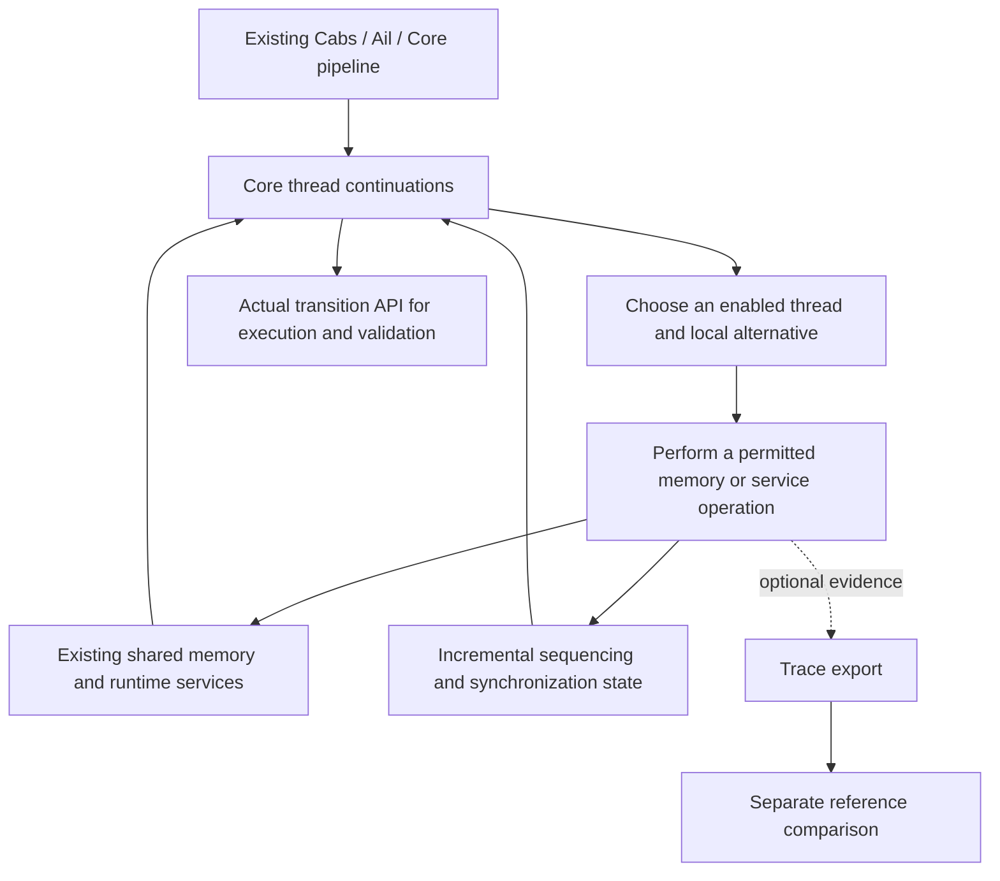

# SC concurrency master plan

Updated 2026-09-28: WP0 landed; WP1 completed its decision/evidence package
at `af1342d32`. Independent review `1c7e52fad` accepts the decision, with
package/plan fixes tracked below. Next-phase coordination agreement is pending. Working branch:
`arc/sc-concurrency`. Mainline:
`mdd/cerberus-lean`. **This is the governing plan for the SC build.** It owns
the objective, work order, acceptance criteria, current status and landing
policy. Detailed designs and slice records support it; they do not silently
change it. No executable SC implementation has landed from this effort.

[USER, 2026-09-24] Build a master plan for successful SC concurrency, treat the
previous branch as a quarry for useful machinery, guard against drift during
a long build, and seek early mainline landings whenever work can be audited
cleanly. The earlier user direction remains: land necessary, independently
validated foundations before choosing the execution strategy. The milestone
and landing decomposition below is [AGENT] implementation planning under that
direction; open design proposals are marked explicitly.

The [re-review](lean_frontend/docs/2026-09-25_sc-concurrency-plan-rereview.md)
accepts the finite WP0, early feasibility experiments and explicit
correspondence work adopted after the first review. Proceed to executable
evidence at those boundaries; another broad planning pass is not required.

**[USER, 2026-09-25, direction summarized] The MVP delivers a coherent and
correct executable SC model. Iris integration is a separate task.** This
removes the external consumer demonstration and Iris adoption gates; it
retains the semantic scope, correctness, scale and reference obligations
below. It does not adopt the first review's narrower C profile. The
[scope record](lean_frontend/docs/2026-09-25_sc-semantics-mvp-scope.md) records
this boundary, deferred work and the re-review's concrete follow-through.

## 1. What we are building and where it fits

Build an operational, executable SC concurrency instance of **the existing
Cerberus semantics**, shared through Lem and usable from Lean. Core continues
to evaluate C; the concrete memory model continues to determine values,
representations, provenance and validity. Concurrency controls how actual
thread continuations advance against shared memory and services, which
operations are indivisible, and how C sequencing, synchronization and races
are interpreted. Expose the actual transition definitions and observations
in Lean; integration with reasoning frameworks is separate work.

Cerberus already has Core thread states, action requests with result
continuations, structured parallel expressions and wait states. Its historic
C11 machinery adds symbolic execution and a separate commitment process over
execution graphs. That integration is currently incomplete. We reuse the
existing request/driver/memory boundaries and reference definitions; restoring
the old weak-memory commitment engine is not a prerequisite for SC.

**[AGENT, WP1 decision] Build selected, bounded Core reductions over current
concrete memory, with explicit owned pending primitives where a source
operation must yield.** Track source sequencing separately from scheduler
order, and use incremental causal/access summaries. The decision record on
`arc/sc-wp1`, `lean_frontend/docs/2026-09-27_sc-wp1-execution-decision.md`,
compares the alternatives and binds the S1–S4 obligations below. The
experiments do not enable public SC support:

The architecture has the following fixed constraints, irrespective of the
WP1 execution decision:

1. Runtime progress, values, existing faults and final results must not depend
   on reconstructing or checking an axiomatic execution graph. Disabling trace
   export preserves semantics, including race checking.
2. Reuse the existing evaluator and object memory. Shared semantic changes live
   in `.lem`; handwritten OCaml/Lean seams remain paired. No second byte store,
   parallel C evaluator or Iris-only mirror executor.
3. Scheduler order does not create C happens-before. Preserve Core's partial
   source sequencing, including unsequenced expressions and calls. A single
   monotonically increasing clock per C thread is not a sufficient design.
4. Concrete byte ranges, C memory locations and atomic object identity serve
   different purposes. Ordinary ordered byte/member operations must work;
   failure of a scalar projection cannot become a language restriction.
5. Preserve completed effects and primary failures. The initial executor stops
   at the first justified UB or unsupported operation; post-UB diagnostic
   continuation is a separate later capability. Distinguish normal results,
   UB witnesses, unsupported operations, blocking and exhausted resources.
   A selected safe execution makes no whole-program safety claim.
6. Scale one selected execution early. Exhaustive schedule search remains
   combinatorial and is a separate concern; raising limits does not repair
   history-dependent runtime work.

See the [technical design and literature](lean_frontend/docs/2026-09-24_sc-concurrency-design.md)
for concrete transition contracts, proof obligations, scale probes and WP0
boundaries. WP1 states the source-frontier and retained-endpoint contracts;
the efficient concrete representation remains an S2 acceptance obligation.
The exact materialized matrix is a proof/measurement baseline with O(R²)
retained cells, not a large-program performance claim.

## 2. Completion means a usable, justified semantics

The target instance includes non-atomic accesses, `seq_cst` atomics and atomic
updates, strong/weak CAS, SC fences, initialization, structured Core fork/join,
and ordinary concrete objects and supported runtime operations. Weak orders
are explicitly outside this instance and are never silently strengthened.
Pthreads, general weak memory, fairness guarantees, partial-order reduction,
a general filesystem port and all Iris integration are separate work. No Iris
experiment, package adoption or compatibility proof is an MVP prerequisite.

SC is complete only when the following claims have evidence against the actual
shipped definitions. Intermediate mainline landings may satisfy smaller,
explicit contracts; they do not imply this completion claim.

| Completion obligation | Required evidence |
|---|---|
| **Executable integration** | Real C elaborates and runs through initialized Core, shared memory, thread creation/join, saved services and finalization. Actual bounded steps return control even on a deterministic singleton path; choice discovery has no unchosen effects. Step and runner laws account for the same state, events and remaining resources. Helper resumption uses current shared state. |
| **C sequencing, synchronization and races** | An exact monitor on the declared domain, with justified summary invariants and first-race preservation; unsequenced/weak/strong source boundaries, publication, fork/join and independent conflicts are covered. No global suppression of findings after an unrelated gap. |
| **Atomic semantics and C surface** | Operation-specific order validation, initialization, indivisible RMW/CAS phases, failed-CAS expected writeback, weak spurious failure and fences work through the actual frontend/runtime. Unsupported weak orders and preprocessing configuration receive honest treatment. |
| **Concrete objects and services** | Ordered byte updates, initialized members, aggregate copies, disjoint locations, overlapping accesses, helpers, lifetime and relevant library effects compose correctly. Sequential behavior is preserved, apart from separately justified corrections. Stream/internal-state protection is modeled or precisely reported as a runtime gap. |
| **Reference justification** | Execution fidelity, scalar trace soundness and coverage, UB/prefix policy, and object conservativity are separately established. Pin the exact predicates and hypotheses; connect proofs and bounded complete-set comparisons to production handlers. A finite comparison is evidence, not a general equivalence theorem. |
| **Scale** | SC scheduler/monitor/receipt overhead is independent of discarded execution history at fixed relevant dimensions. The §7 technical-design probes also report whole-run time/RSS and separately attribute inherited trace, lifetime, output and closure costs. Test fixed objects, lifetime churn, repeated source split/join and repeated thread creation. No unqualified whole-machine live-state bound. |
| **Usable observations** | Public output and the API preserve results, failure-time state, retained findings, model gaps and incompleteness. Budgets are explicit; timeout is neither safety nor an empty allowed-outcome set. |
| **Semantic interface** | Actual configurations, transitions and observations are available in Lean, with bounded-runner correspondence and explicit semantic atomicity boundaries, exercised by the production examples. A justified whole-machine relation is sufficient; no Iris-specific thread-pool presentation or external-client example is required. |
| **Release integrity** | Fresh identified artifacts, required repository gates, independent semantic evidence, an audited supported profile and an exact unresolved-obligation list. Backend agreement establishes port evidence, not correctness of their shared semantics. |

The initial axiomatic theorem may have a narrower, explicit scalar domain
than the executable object semantics. The latter needs its own composition
argument; restricting the theorem does not discharge that obligation. WP1
records the theorem/domain schemas and decomposition, including initialization,
fences and source receptiveness; S1–S4 must instantiate and discharge them
against the actual definitions. Completion cannot be obtained by quietly
reclassifying required ordinary behavior as unsupported or replacing a proof
obligation with a passing test suite. A material scope change is a visible
plan revision discussed with the user.

**First executable milestone V1:** before expanding atomic or concurrent
service families, keep one end-to-end lane running through real C on both
backends: initialization/main/finalization, structured fork/join, SC integer
load/store publication and its missing-synchronization control, disjoint
members and a same-location race, an ordered byte update followed by an
independent race, and a deterministic loop under a tiny step budget. The lane
uses actual program entry, transition API, monitor and observation codec.
Record schedule/local choices and classify each case as complete enumeration
or a selected prefix; independently specify its expected observations.

V1 is an internal validation milestone with concrete supported cases, not a
smaller public release or a general C support claim. Unsupported operations on
that path must report unsupported through the actual entry; no sequential
fallback, invented atomicity or refusal disguised as UB. Stop at first UB or
unsupported operation. Keep ordinary ordered helpers available where already
justified; admit concurrent helper families only after their boundary tests.

**WP-C — correspondence, on the critical path:** begins in WP1, alongside the
execution experiment. Its first deliverable is well-typed candidate theorem
statements, nonvacuous example hypotheses and a decomposition into execution
fidelity/erasure, monitor and first-race preservation, scalar soundness,
scalar coverage, and object conservativity. A checked statement is not a proof.
Pin initialization forms and reference predicates at this point; the NA/SC
order restriction alone does not establish the model-domain hypotheses.
Coverage must account for actual Core read-dependent control flow and source
receptiveness. Executable `true` stubs in `cmm_csem.lem` discharge nothing.

At the WP1 checkpoint, also demonstrate a substantive general lemma about the
riskiest link from actual Core transitions to the chosen reference invariant
or linearization argument. A closed-program calculation, definitionally equal
wrapper or theorem assuming the desired reference predicate is insufficient.
Reuse the experiment's production definitions, keep its declared fragment
bounded, and report the hardest unresolved obligation before feature expansion.

WP-C's obligations attach to the responsible S1–S4 changes and name which
production definitions they concern, what is proved, what has only bounded
evidence, and what remains open. V1 supplies an early concrete connection;
S5 cannot waive unproved release obligations. If WP1 cannot give a credible
decomposition, revisit the design or explicitly discuss release scope before
broad implementation. General correspondence is not left for final audit.

## WP1 decision: constraints on the next implementation

The detailed decision/evidence record lives with the experiment on
`arc/sc-wp1` at `af1342d32da0f47844c3856057ed1dd38ec4a164`. It chooses
direct selected Core stepping plus narrowly justified
pending operations. `SeqRMW` yields between read/update/store to other threads
while owning its source continuation; its updater uses current memory. A
same-thread C call remains outside the pair. Neither ownership nor scheduler
selection invents source order. A child completion that would rewrite an
owned parent's continuation waits until ownership ends. S1 carries primitive
ND alternatives per owner and preserves the actual lifecycle.

Source instrumentation has separate value-completion/all-effects frontiers,
with weak/strong/negative/unseq/call and fork/join rules. Retained causal roots
include immutable publications and per-location access summaries. Kernel
extension/projection laws concern an abstract relation; the Core
unseq/exclusion lemmas are local, Core-internal properties. Neither proves
the connection from Core source order to the axiomatic reference;
source-shaped observers and finite comparisons are not yet a general
production monitor. Coverage through actual read-dependent Core
control flow remains the hardest WP-C obligation. Reopen the design if its
S1/S2 replay construction fails before broad S3 expansion.

S1 must resolve positional fork-result order and upstream's explicit
`subst_wait_stack ==> Stack_cons2` refusal. Both behaviors are inherited
from pristine upstream, and `Epar` is reachable through the non-ISO C par-block
extension. Before implementing a shared-model change, prepare positional,
nested/call-frame and C-par-block evidence, an upstream-tray draft and the
proposed `scripts/upstream_oracle_differences.json` `shared-model-fix` row,
and obtain an explicit [USER] adjudication of the deviation. ISO-C arguments
alone do not decide an extension's semantics. The Lean-only WP1 adapters are
experiments, not authorization for a production divergence.

S1 must also address unbounded retained diagnostic output and
temporary-environment growth under negative hoisting. The latter needs
lexical support/continuation reasoning, not a numeric-symbol cutoff. The
churn experiments stream output and measure semantic environments separately;
there is no claim that the existing whole interpreter has bounded storage.
Repeat churn with actual child runtime allocations and their lifetime policy;
the candidate's null child errno does not measure that production cost.
These are explicit dependencies of S1 scale acceptance, not hidden cleanup
after public enablement. Land independently useful corrections early when
their own contracts and evidence pass review.

The initial scalar theorem uses `SC_memory_model` / `SC_condition` with
atomic initialization before all accesses and the reference's actual
same-thread indeterminate-sequencing condition. No single-writer restriction
is introduced. Reference consistency and definedness are distinct: complete
coverage requires `each_empty SC_memory_model.undefined X`, a valid initial
configuration and source-justified adequate resources, and yields a completed
run. First-conflict prefixes and whole-program UB lifting remain separate
obligations. Resource adequacy must be shown to exist for each supported
finite source path, never defined circularly from runtime success.
`SC_condition` excludes fences and lifetimes: S3 uses the
seq_cst-only restriction of `sc_fenced_memory_model` and proves the no-fence
agreement; S4 supplies object/lifetime conservativity. No use of upstream
program-level `true` stubs or automatic transfer of `bigthm` is permitted.

## 3. Work packages and audit boundaries

Milestones describe evidence, not donor commits or quotas of new code. Reuse
correct mainline behavior unchanged. Subdivide a row whenever a smaller useful
change can pass its own audit. Reference and proof work accompany semantics
throughout; S5 assembles established results rather than starting them.

| Package | Deliverable and dependency | Exit / earliest landing boundary |
|---|---|---|
| **WP0 — necessary foundations** | Close after one paired load/store observation slice with its real diagnostic consumer: load results, same-value writes, returned failure state, ND alternatives and completed-operation prefixes. Reuse existing state transport where sufficient. | Disabled-observer erasure, bounded/drainable receipts, state/choice preservation and operation-proportional capture cost. F1 transport and minimal F2 land together; only F3 needed by this consumer belongs here. **Closed: WP0 accepted and landed at `5ecc0aa33`.** Helper/lifetime/metadata extensions and F4 do not hold WP0 open. |
| **WP1 — execution feasibility and decision** | Decision/evidence package on `arc/sc-wp1`: selected Core steps plus owned pending primitives; exact source/retention contracts; typed WP-C schemas and general local production lemmas. Alternatives and remaining proof obligations are explicit. Complete at `af1342d32`; independent review `1c7e52fad` accepts the decision at feasibility scope, with package/plan fixes. | Independently derived source relations/first conflicts; a substantive summary invariant; repeated fixed-width source split/join and bounded-live-thread churn with coordinate/reference accounting; singleton-step yield, pure discovery and step/run agreement. Failures reopen design before broad S1/S3 extraction. Commit the decision only after these witnesses; no donor scheduler is adopted by default. |
| **S1 — actual bounded transition API** | Implement the chosen thread/Core alternatives, program continuation, per-owner primitive continuations and observations, including actual child runtime/errno initialization. Resolve positional fork results and upstream's explicit modern-stack wait refusal through the evidence/tray/register/[USER] process above before shared-Lem implementation. Include initialization/finalization, explicit resource accounting, production output streaming and sound lexical temporary reclamation. Add other services with their first justified concurrent consumer. Depends on WP0/WP1. | Deterministic-loop budget control, effect-free choice discovery, step/run agreement for state/events/resources, `SeqRMW` non-atomicity, nested fork/join, blocking and selected-loop scale. Completion/UB/unsupported/blocked/exhausted are distinct. Internal until semantic acceptance; an observed ND node alone is not a thread step. |
| **S2 — source order and race semantics** | Implement and justify summaries for source sequencing, synchronization and conflicts over S1. Use the minimal SC access/fork/join rules; full atomic operation coverage follows in S3. | Independent relation comparison and summary/first-race arguments; unsequenced expressions, separate members, same-element races, publication and race-before-loop. Recheck scale with the monitor enabled. Land separable summary/monitor units with their actual consumers and precise contracts. |
| **S3 — full atomic operations and C surface** | Minimal real-C load/store/initialization lowering accompanies S1/S2 for V1. After V1, extend to full order validation, RMW/CAS, fences and callable library coverage. Initialization's semantic/reference obligations are decided in WP1. | Keep V1 green through each family; complete bounded production/reference comparisons, a production mutation control, independent SB/MP/CAS expectations and a real linked callable fence. Land validated operation families separately. |
| **S4 — object and runtime composition** | A cross-cutting track over WP0 and the relevant S1–S3 changes. Ordinary objects are exercised from the first handler; helpers, lifetime and precise library protection extend them. | Ordered byte/member/copy cases, helper interference and effects before failure, actual location/lifetime conflicts, ordered library calls and shared-service cases. Land each useful fix separately. Pull needed work forward whenever an earlier gate depends on it; do not postpone object correctness until after atomics. |
| **WP-C — correspondence** | Explicit cross-cutting work over WP1 and S1–S4, with the decomposition above and technical-design §6. | Every release obligation has a precise statement, responsible semantic slice and evidence status. Initial theorem/domain plan precedes broad extraction; discharged obligations accompany code. No automatic transfer from upstream assumptions or bounded comparisons. |
| **S5 — public SC semantics delivery** | Stabilize and document the already executable whole-program API and public mode after S1–S4 and WP-C. | All §2 claims connected to shipped definitions, production V1/extended examples, honest public observations and full applicable release checks. This is the feature-enablement landing, not the first mainline landing or the first step API. Iris adoption is separate. |

WP0 excludes scheduling policy, new suspension constructors, atomic transaction
boundaries, clocks/race algorithms, graph adapters, library-lock policy and a
public SC switch. A demonstrated sequential defect discovered along the way
can be fixed and landed as its own slice. Completing unrelated filesystem
capabilities or redesigning the entire frontend is not a hidden dependency.

Keep three contracts separate: primitive receipts describe actual memory
operations at returned nodes/states; logical C actions carry source sequencing,
location and atomic-operation meaning; scheduler boundaries determine where
another thread may advance. Address/size footprints alone do not determine C
memory locations. Receipts need no sequence of historical memory snapshots.
Draining a helper's receipts after completion does not supply earlier
interleavings or first-internal-race state. Connect observation to justified
suspension before claiming concurrent helper support.

## 4. Land useful work early

**Prepare a landing whenever a completed slice is useful on current mainline
and its contract can be audited independently. Do not accumulate completed
slices merely to produce one eventual concurrency merge.**

The expected landing sequence is:

| Landing | When to propose it | What it claims |
|---|---|---|
| **L0: plan and diagnostic seeds** | After review of this master plan and its supporting records. This branch is the candidate. | Governing direction and reproducible failure evidence only; no new runtime support. |
| **L1: first passive effect slice** | As soon as minimal load/store receipts plus any necessary existing-state transport pass their independent audit and sequential checks. | Useful observation of existing memory behavior. No scheduler or public SC. |
| **L2…: subsequent semantic, receipt or sequential fixes** | WP0 has landed. Add helper/lifetime/metadata receipts with the first execution feature consuming them; independent sequential fixes can land when ready. F4 normally accompanies S3. | Exactly the new capability or corrected behavior, without future scaffolding; these are not prerequisites for closing WP0. |
| **Execution decision and internal semantic slices** | WP1's decision can land as documentation. S1–S4 changes land when their stated contracts and dependency boundaries are independently checked. | Audited internal capabilities with real consumers and explicit remaining obligations. Experimental outcomes are not advertised as accepted C behaviors. |
| **Public SC enablement** | S5 and every applicable completion obligation have passed. | The documented SC instance and actual provider interface, with exact supported scope and evidence. |

For each landing:

1. Build a short branch from the then-current `mdd/cerberus-lean`, containing
   only that slice and already landed prerequisites. The long-lived
   `arc/sc-concurrency` branch coordinates the plan and bounded experiments;
   it must not become an alternate mainline accumulating unaudited features.
   If two changes cannot be validated independently, make their smallest
   coherent combination the landing unit and state why.
2. Prepare a concise dated acceptance record: problem/contract, exact
   base/head, dependencies, donor provenance if any, source of expected
   behavior, checks/proofs, a meaningful failure control, relevant cost,
   sequential effects, and remaining limits. Identify source and built
   artifacts. Reusing a donor test does not adopt its expected answer.
3. Run focused validation and the applicable required repository gates under
   [LADDER.md](scripts/LADDER.md) and
   [VALIDATION.md](lean_frontend/VALIDATION.md). Keep documentation checks
   distinct from runtime certification. No stale generated artifacts or
   baseline changes without an independent explanation.
4. Once the candidate is concrete, propose audit scope/scale and independent
   review to the user. Use the existing [branch policy](CLAUDE.md#branch-roles)
   and workspace pre-merge practice: review
   the actual source/state contract and evidence, resolve findings, and
   obtain explicit sign-off for the exact ff-only mainline landing. This
   planning instruction establishes early landing intent; it is not blanket
   merge or push permission. Do useful preparation before that final ask.
5. If mainline moves, rebase the small candidate, inspect conflicts, rerun
   invalidated checks and renew readiness/sign-off as required. After
   landing, record the mainline commit here and reconcile any dependent work
   already based on its audited candidate. [USER, 2026-09-25] WP1 may proceed
   while the overseer handles WP0 landing; the landing sequence does not block
   that investigation. Synchronize the coordination branch without reviving
   accepted or rejected donor patches. Functional Lem changes retain the existing
   Lem-first, re-pin, revalidate landing order.

Do not propose an isolated abstraction with no immediate consumer, a helper
whose correctness assumes unfinished later machinery, or public enablement
that makes incomplete executions look valid. Split or combine such a patch
until the contract is real. This rule enables early useful landings without
weakening semantic acceptance.

## 5. How the old branches are used

`arc/sc-prototype` is a **quarry**, not the implementation base or the project
roadmap. Pinned implementation: `631382a9d23a709112f38add53357d4cbe6fc108`;
documentation-only handoff: `4860f0ef0d20f2a2a4d8d96e6ecfc7b2c99ceed2`.
The older `feature/concurrency` is another source of counterexamples.

The [quarry assessment](lean_frontend/docs/2026-09-24_sc-prototype-quarry.md)
maps candidate machinery to independent acceptance boundaries. Effect capture,
failure-state handling, continuations and atomic lowering may be useful;
none is accepted because the donor called it complete. Extract the minimum
needed, adapt it to current mainline and prove/check its contract afresh.
Rewrite when extraction would preserve the failed architecture. Never merge
or rebase the donor wholesale.

The accumulated-graph admission path, scalar single-writer restriction and
global suppression of races after an interpretation gap are rejected runtime
designs. Offline reference code may be extracted only for its explicit
comparison domain. Old test counts and paired-backend agreement are evidence
to investigate, not approvals.

## 6. Status, next action and drift control

Status is updated with each accepted decision or slice. **Implemented,
validated, independently audited and landed are different states.** A row
becomes landed only with a mainline commit. The table is current truth;
dated evidence remains historical and should not be rewritten to match it.

| Item | Current state | Evidence / next action |
|---|---|---|
| Mainline base | Observed September 28: local `mdd/cerberus-lean` at `d62f52121`, including WP0 (`5ecc0aa33`) and the CerbFS path hotfix; Lem remains `c2a68e79b6369e19f099dfa48767319c1daf19b3`. | WP1 was validated on its recorded WP0-based tree; that evidence does not certify the later mainline. New runtime slices start from the then-current mainline and run its applicable gates. |
| Master plan / L0 | Independently re-reviewed at `a740c48ae`; WP1 update reviewed at `1c7e52fad`, with M1/S5 corrections incorporated here. Semantics-only MVP direction retained; no mainline landing of this coordination branch. | The September 27 decision/evidence record is on `arc/sc-wp1` at `af1342d32`; the review response is `186392a53`. Review of the original update is not independent re-review of these corrections or public feature acceptance. |
| Diagnostic seeds | 21 donor inputs with recorded hashes, one new input, and bounded donor/mainline/pristine observations. | [Inputs](tests/sc-recovery/README.md), [diagnostic evidence](lean_frontend/docs/sc-recovery-evidence/README.md). These remain diagnostic, not a passing SC suite. |
| Sequential `_Bool` repair | **Landed** with WP0, as rebased commit `d61dcb9c4`, included in `5ecc0aa33`. | The original fix/audit records and overseer's landing records preserve the old and rebased identities. |
| WP0 / L1 | **Closed and landed** at `5ecc0aa33`, following the overseer's reconciliation and skeptical reviews. | Receipt implementation `3cb7f7587`, closure `0e3f67cd2` / `a997d49ce`, skeptical reviews `2d445ea2f` / `06648fa94`. Read the mainline WP0 records for consumer exposure, capped process checks and validation. Later receipt producers accompany actual execution consumers. |
| WP1 / WP-C entry | [USER, paraphrased] Push to the end of WP1. [AGENT] Rebased on landed WP0; preceding experiment is now `b52f9e660`. **Decision/evidence complete at `af1342d32da0f47844c3856057ed1dd38ec4a164`; review `1c7e52fad` accepts the decision and accepts package/plan with fixes.** | `SC-WP1.md` and `lean_frontend/docs/2026-09-27_sc-wp1-execution-decision.md` on `arc/sc-wp1`. Full A+B: 40/40 commands; mandatory 872-case three-engine report passed its gate, with historical report-only differences preserved; focused experiments and ten axiom cones passed. Source/artifact identities and limits are recorded with the code. New evidence: pending SeqRMW/call boundaries, positional/nested fork, actual read-dependent publication, first-conflict prefix, 8192-round Core split/join and thread churn, exact retained-root invariants and general production unseq/exclusion lemmas. The record preserves the hard remaining source/control-flow coverage and object/scale obligations. No public SC mode or mainline landing. |
| V1 / S1–S5 / WP-C proofs | Production implementation/release obligations remain. WP1 supplies local proof entry points and statement schemas, not full correspondence. | Keep the real-C publication/fork/join/budget lane through extensions. Full release still requires §2. |

The independent WP1 review is committed on `review/sc-wp1-20260928` at
`1c7e52fad`, `lean_frontend/docs/2026-09-28_sc-wp1-independent-review.md`.
Its targeted re-runs support the feasibility decision; they do not replace a
full landing validation. M1's upstream-change process and S5's proof-scope
wording are incorporated here. The response on `arc/sc-wp1` at `186392a53`,
`lean_frontend/docs/2026-09-28_sc-wp1-review-response.md`, records the harness
fixes and remaining landing condition M2: experimental shared-Lem factoring
requires a scoped reconciliation with the September 4 ruling and operator
confirmation, or an independently reviewed isolation of the experiment. A
manifest refresh or accepted feasibility decision is not that approval.

The [September 28 coordination response](lean_frontend/docs/2026-09-28_sc-next-phase-coordination-response.md)
answers the next-phase track's proposed shared-surface rules. It proposes joint
transition/outcome/configuration contracts and serialization of overlapping
slices, while preserving early independent landings. It accounts for the newer
contract/refusal decisions. **[AGENT] Counterproposal pending joint agreement;
no S1 implementation or Lem pin is reserved by it.** The SC completion
requirements and semantics-only MVP scope are unchanged.

The WP0 acceptance records and evidence now live on mainline at `5ecc0aa33`;
read its landing and skeptical-review records for the final closure. The
earlier candidate record is still available via
`git show e1c1d2c3a:lean_frontend/docs/2026-09-25_sc-wp0-review-response.md`.
That historical record gives both immutable audit identities, finding
dispositions, the approved documentation delta and final fast-gate evidence, and links the original
receipt/repair records. Those retain the diagnostic scope, tested source/binary
identities, prior rebase evidence, cost limits and optional-backend build
limitations. The observed native-binary replacement is accounted for by the
other auditor's full-run rebuild; the historical evidence is not relabelled.
No merge or push is authorized by this status update.

Maintain one short current record for each active slice; do not start a second
status ledger. A later contributor begins here, reads the relevant design
section, checks actual Git state, then works on the next unsatisfied contract.
Each change must identify the milestone and obligation it advances, its
consumer, and its evidence. Scope follows the requirement, not the available
donor code.

Record design decisions with alternatives, reasons and implications for
tests/proofs. Update this plan in the same change when the decision affects
work order, supported behavior or acceptance. Material changes to the target
or these constraints require discussion with the user; routine implementation
choices within the adopted contract do not. Preserve dated evidence and user
directions without growing this file into a chronological log.

Reopen the relevant design boundary when a counterexample defeats a semantic
rule, required ordinary objects are being excluded, an SC runtime path needs
the whole history, evidence tests a proxy rather than production, or a supposedly
small slice acquires unrelated prerequisites. Keep progressing on independent
obligations. Do not repair such failures by weakening the checker, relabeling
the requirement, increasing fuel or importing more of the prototype.

## Supporting records

- [Technical design, literature and detailed acceptance](lean_frontend/docs/2026-09-24_sc-concurrency-design.md).
- [Prototype quarry assessment](lean_frontend/docs/2026-09-24_sc-prototype-quarry.md).
- [Diagnostic evidence and its limits](lean_frontend/docs/sc-recovery-evidence/README.md).
- [Proposed input corpus and provenance](tests/sc-recovery/README.md).
- [Independent September 25 review](lean_frontend/docs/2026-09-25_sc-concurrency-plan-review.md) and [implementing response](lean_frontend/docs/2026-09-25_sc-concurrency-review-response.md).
- [Independent re-review](lean_frontend/docs/2026-09-25_sc-concurrency-plan-rereview.md) and [semantics-only MVP scope decision](lean_frontend/docs/2026-09-25_sc-semantics-mvp-scope.md).

This master plan supersedes the concurrency work order and candidate-integration
assumptions in the September 5 general plan, September 6 concurrency charter,
September 24 recovery note and donor handoffs. Their historical facts and
unrelated project obligations remain records. Current project practices and
validation requirements continue to apply; this document does not waive them.
