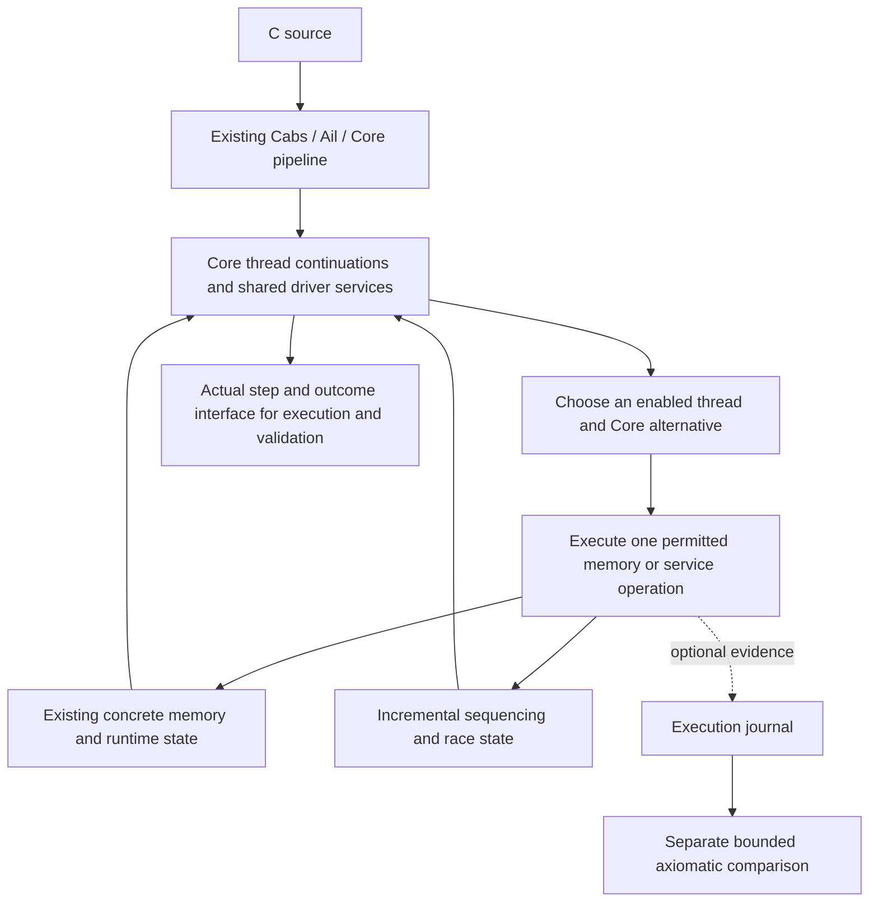

# SC concurrency: technical design and evidence requirements

> **Superseded in part, 2026-09-29.** [USER 2026-09-29] ruled that S1 mirrors
> upstream's positional fork-result order and `Stack_cons2` wait refusal and
> refuses loudly ("mirror and refuse seems safest"). The fork/wait
> "evidence/tray/register/[USER] process" prescribed below (the S1 row of the
> slice table and the WP1-decision summary) no longer applies, and WP1's
> experimental code does not land. Current constraints:
> [SC-CONCURRENCY.md](../../SC-CONCURRENCY.md) and the
> [assessment and rulings](2026-09-29_sc-assessment-and-rulings.md).

Date: 2026-09-24; revised 2026-09-25 after independent review and
2026-09-27 to connect the WP1 decision. Supporting
technical design for the governing
[SC concurrency master plan](../../SC-CONCURRENCY.md). That plan owns scope,
work order, status, completion and mainline landing policy. This document
supplies the detailed contracts, literature and diagnostic rationale. Open
proposals below remain proposals; no new SC implementation or equivalence
theorem is claimed by this branch. Work order:
**WP0 closes with the minimal paired load/store observation slice; WP1 then
establishes feasibility and selects the execution strategy; later packages
implement and justify that strategy, with explicit correspondence work WP-C.**

The [review](2026-09-25_sc-concurrency-plan-review.md) and
[response](2026-09-25_sc-concurrency-review-response.md) record the reasons for
the finite WP0 exit, early bounded-step/summary experiments and cost separation.
The [re-review](2026-09-25_sc-concurrency-plan-rereview.md) accepts that work
order. The user's [MVP scope decision](2026-09-25_sc-semantics-mvp-scope.md)
defers Iris integration and its external example. Semantic scope and
correctness obligations remain; no narrower C profile is adopted.

[AGENT, 2026-09-27] WP0 has landed at `5ecc0aa33`. WP1's decision and
evidence are in `lean_frontend/docs/2026-09-27_sc-wp1-execution-decision.md`
on `arc/sc-wp1` at `af1342d32da0f47844c3856057ed1dd38ec4a164`;
the master plan records its validation/review status.
That decision chooses the construction below, subject to the explicitly open
S1/S2 production and correspondence obligations. Sections 6–9 retain the
acceptance requirements; satisfying an experiment is not proof of the final
implementation. No public SC mode is enabled.

## 1. The operational integration comes first

The WP1 decision chooses a direct interleaving machine over the current
Cerberus Core evaluator and concrete memory model, with owned pending
primitives at justified suspension points. WP0 remains a passive foundation.
A selected thread requests an operation; that operation
executes against the current shared memory; its continuation resumes with the
actual result. SC atomic operations are indivisible at their specified object
operation. Ordinary accesses retain C's sequencing and race rules. An
incremental semantic monitor detects races and sequencing violations from the
current operation and retained summaries.

**Neither selecting a step, computing a value, reporting an existing fault,
nor admitting a completed execution may require constructing or checking an
axiomatic execution graph.** The small reference checker is a separate
validation tool. Its trace export can be disabled without changing semantics.
This includes removing final-candidate admission, not merely making prefix
checking less frequent.

The shared definitions belong in `.lem`, generated to OCaml and Lean. The
concrete OCaml/Lean seams remain paired. This follows the existing separation
between Core requests, the driver, and memory; it does not add another C
evaluator, another byte store, or an Iris-specific executable language.

## 2. Authority, base, and presumption about the donor

The user's current instruction is a complete SC build, using the failed branch
as a quarry for independently validated machinery. The failed branch and its
handoff are **untrusted evidence**.
Their roadmaps, completion labels, claimed approvals, and test counts do not
govern this project. A component starts as a hypothesis about reusable work.
No component below is accepted merely because it exists or has tests.

The working branch is `arc/sc-concurrency`, renamed from the initial
`arc/sc-recovery-20260924` planning branch. It was created at mainline
`e9f9d049ffaaf005c392495b0f6418d21f4df29f` (short identity `e9f9d049f`). The
checked-out mainline
and its local origin-tracking ref agreed when inspected. A live `git ls-remote`
failed on GitHub DNS resolution, so remote freshness is unverified.

The principal donor implementation is `arc/sc-prototype` at
`631382a9d23a709112f38add53357d4cbe6fc108`, based on `5407597d9`. It has 29
implementation commits absent from current mainline; current mainline has 31 commits absent
from that implementation tip. The donor's subsequent documentation-only
postmortem landed at `4860f0ef0d20f2a2a4d8d96e6ecfc7b2c99ceed2` and has been
read; it does not change the runtime under investigation. Excluding generated
`tests/libc/libc.core`, the implementation change from the common
base spans 401 files, with 24,911 insertions and 2,574 deletions. The older
`feature/concurrency` at `086d8762d` is a second source of counterexamples and
candidate inputs, not a fallback implementation.

Each implementation slice should start from the then-current mainline, with
only its already accepted prerequisites. Use a small commit or short branch
per slice. Reapply justified changes to current APIs; do not rebase or merge
the donor wholesale. In particular preserve mainline's explicit enum/program
data, run digest, supply and address-space parameters, arity repairs, and
failure handling. Separate landing means a separately reviewable improvement;
it does not mean silently enabling a partially validated public SC mode.

The initial investigation supplied this technical design, a
[quarry assessment](2026-09-24_sc-prototype-quarry.md), measured donor evidence,
and 22 small proposed regression inputs. No runtime source was transplanted.
Each later extraction remains subject to its own acceptance boundary. Current
status and landing order live in the master plan. Mainline and donor worktrees
were left untouched by the investigation.

## 3. What failed, with checks independent of the handoff

Source inspection identifies two architectural problems in the latest donor:

* `driver.lem:219` calls `sc_note_prefix` after recorded effects. That invokes
  `sc_interpret_driver` and `sc_interpret_candidate`, rebuilding relations from
  accumulated history. `drive` at line 2685 also makes final graph classification
  an admission condition. Optimizing transitive closure does not remove that
  dependency or all the other history scans.
* `sc_candidate.lem:288` requires a read's bytes to come from one whole-range,
  equal-valued writer; line 168 rejects other overlapping views except a special
  array-initialization case. Concrete memory already supports ordered byte
  composition. The scalar adapter incorrectly becomes a gate on ordinary
  object-memory execution. At line 497, any interpretation issue disables all
  newly discovered data/unsequenced races, including unrelated ones.

Fresh selected executions of existing, hash-recorded donor binaries reproduced
both ordered failures on OCaml and Lean: byte update returns 1 sequentially;
initialized member reads return 42 sequentially; both are refused under SC.
The binaries were not rebuilt here, so these are identified-binary diagnostic
runs, corroborating the source analysis, not fresh-build certification.
[Commands, statuses and outputs](sc-recovery-evidence/donor-reproductions.json).

A separate one-thread `for` loop shows the cost without interleaving search:
8 iterations took 0.188 s under SC, 16 took 1.439 s, and 32 and 64 each timed
out after 10 s. Sequential runs took 0.031–0.038 s. All runs selected one
execution. This is a bounded diagnostic, not a statistically fitted complexity
claim. [Sources and measurements](sc-recovery-evidence/donor-selected-cost.json).

The donor also carries potentially useful continuations and failure-state
handling. Those observations motivate inspection, not a correctness verdict.
The full inventory explains which claims each candidate still needs to earn.

## 4. Model identity and the literature

The product target is **Cerberus concrete-object SC with non-atomic accesses,
seq_cst atomic accesses/RMW/CAS, SC fences and structured Core fork/join**.
It preserves the existing sequential object/value semantics and explicitly
states concurrency composition rules. Weak atomic orders are outside this
instance and must not be strengthened. Pthreads, general weak memory, fairness
guarantees, a new filesystem implementation and Iris integration are separate
work. The MVP delivers the SC semantics itself.

This choice is a restricted concurrency instance, not a claim to implement
all C11. Its ordinary object behavior must include ordered byte updates,
aggregate/member access, allocation, pointers and existing memops. A scalar
proof domain must not turn into an arbitrary scalar-only runtime restriction.

Relevant primary sources and their actual role:

| Source | Consequence for this design |
|---|---|
| [Lamport, 1979](https://www.microsoft.com/en-us/research/wp-content/uploads/2016/12/How-to-Make-a-Multiprocessor-Computer-That-Correctly-Executes-Multiprocess-Programs.pdf) | The global interleaving order supplies the intuitive SC construction. C still needs its own partial source sequencing and UB policy; scheduling order does not define either. |
| [Batty et al., POPL 2012, §4](https://www.cl.cam.ac.uk/~pes20/cppppc/popl079-batty.pdf), [proof materials](https://www.cl.cam.ac.uk/~pes20/cppppc/) | The C/C++ DRF-SC result has atomic-initialization and threadwise-semantic hypotheses. It provides a theorem template, not automatic coverage of this driver, fences, bytes or every initialization lowering. |
| [Nienhuis, Memarian, Sewell, OOPSLA 2016](https://www.cl.cam.ac.uk/~pes20/rems/papers/nienhuis-oopsla-2016.pdf) | Mechanized equivalence supports incremental operationalization. Full weak C11 needs a commitment order different from simple program/SC order. The paper explicitly does not present an efficient implementation and its integration excludes non-scalar objects. Reuse the architectural separation and proof lessons, not its full commitment engine for this SC task. |
| [Memarian thesis, chapter 10](https://www.cl.cam.ac.uk/techreports/UCAM-CL-TR-981.pdf) | Describes the actual Core/driver concurrency interface and independently progressing symbolic/commitment execution. It also records that the old integration stopped running as Cerberus evolved. There is no intact upstream full-C concurrency oracle to invoke. |
| [Cerberus-BMC, CAV 2019](https://people.csail.mit.edu/stellal/papers/cerberus-bmc-CAV19.pdf) | An independent bounded Core-to-SMT translation can check small overlapping domains. It is not the operational runtime, nor a universal concrete-memory oracle. |
| [Flanagan and Freund, FastTrack](https://users.soe.ucsc.edu/~cormac/papers/pldi09.pdf) | Shows how race detection can summarize a trace incrementally with clocks/epochs. Its ordered thread traces do not directly model Core's unsequenced and weakly sequenced evaluations. Adaptation needs a correctness argument; importing its algorithm is not enough. |
| [Kaiser et al., iGPS, ECOOP 2017](https://plv.mpi-sws.org/igps/) | Background for future reasoning clients: operational weak-memory semantics can support Iris, so Iris does not force this SC choice. Integration is outside the MVP; this reference introduces no consumer acceptance gate. |
| [Lahav's December 2025 corrigendum](https://www.cs.tau.ac.il/~orilahav/papers/pldi17_corrigendum.html) | A correction to the RC11 register-promotion claim reinforces the need to pin exact definitions and theorem hypotheses. Switching to an unspecified “modern RC11” would not close this project's obligations. |

Pin the scalar comparison to upstream Cerberus
`b9aeedcb4dd438763b0eef7f95ac19e93875d7de`, with a reviewed mapping from
`cmm_csem.lem` to an isolated reference carrier. The proposed fence-aware
comparison is `sc_fenced_memory_model` and `sc_fenced_condition`, **additionally
restricted to the NA/Seq_cst operation domain**. That condition alone admits
weak orders. Keep the exact target visible in every comparison result.

Do not substitute `SC_condition` without checking its narrower hypotheses:
it excludes fences, allocation/deallocation, and has an initialization
restriction. Likewise the source's `bigthm` relates SC and `tot` behavior only
under `opsem_assumptions` and `tot_condition`, including boundedness and
initialization conditions. Several executable stand-ins for those hypotheses
return `true`; a theorem declaration or such a Boolean is not a proof about
current Core. The historical `tot_data_races` adjacent-event predicate is not
the desired per-run happens-before monitor.

The WP1 statement schemas distinguish consistency from per-execution
definedness using the actual `each_empty SC_memory_model.undefined X`.
Complete defined-outcome coverage also needs a valid initial state and
source-justified adequate generated-call resources, and must produce a
completed run. S1 must prove adequate resources exist for supported finite
paths; a predicate defined as runtime success would be circular. This does
not establish program-level definedness, which quantifies over all
consistent feasible executions. First-race prefixes have a separate law.

Beyond SC (outside the MVP): the [weak-memory forward note](2026-09-30_sc-weak-memory-forward-note.md)
records the operational and robustness-theorem routes and the design disciplines
that keep them open.

## 5. Transition contract and remaining production obligations

The WP1 decision adopts the following contract for S1–S4. Its bounded
experiments establish local feasibility, not a complete implementation.
WP0 does not choose scheduling granularity, causal summaries or a
runtime/reference correspondence theorem.

Use the configuration

`K = (program data, thread continuations, shared memory, runtime services,
      sequencing/synchronization summaries, supplies, execution resources)`.

A journal is optional evidence outside the information needed for future steps.
Runtime summaries are semantic state: removing the journal does not remove race
checking. Entries containing suspended computations have no executable equality;
do not merge states by comparing or discarding their closures.

| Operation | Required operational behavior |
|---|---|
| Local Core step | Reuse `Core_reduction.step_ctx` and existing expression evaluation. Preserve every offered local alternative, fault and constraint. Never execute arbitrary other-thread work during request discovery. |
| Ordinary read/write | Use actual `Mem.load`/`Mem.store` values, provenance, byte representation and validity checks. Check the new effect against relevant conflict summaries. Scheduling one first does not order conflicting C accesses. |
| SC load/store | Access current memory. Track the selected atomic object's latest modification and synchronization summary. A load acquires from its actual source; a store publishes its source-order history. A global SC position does not itself create happens-before between threads. |
| RMW / CAS | One indivisible object operation with no intervening object modification. Preserve operation-specific order validation, weak spurious failure and failed-CAS expected writeback. Expected/desired evaluation and ordinary expected-object accesses have their own phases; do not make an entire library call indivisible. Ordinary `SeqRMW` remains non-atomic. |
| Fork/join | Reuse Core `Epar`/wait state, thread-local environments and actual child completion. Transfer the appropriate source causal frontier at creation and join. Include child runtime initialization/errno; a null placeholder does not establish support. |
| Fence | Preserve SC order and the restricted model's actual fence rules. In this all-SC-access domain, simplify only with a lemma; do not implement every fence by merging all thread clocks. Signal-fence meaning is separate from interthread synchronization. |
| Helper / library | Preserve the ordered primitives of memcpy/memcmp/realloc and runtime memory effects, including prefixes before failure. Suspend only at justified primitive boundaries and resume against current shared state, never a saved memory snapshot. Abstract FS ownership protects transaction state; it is not a C stream lock. |
| Lifetime | Use allocation identity plus lifetime and actual subobjects, not numeric address alone. Retain deallocation effects and invalidation. Apply allocator synchronization only on actual reuse paths and with the relevant source rule. |

**Three distinct identities:** concrete byte ranges determine value composition;
C memory locations/subobjects determine conflicts; atomic object identity
determines indivisibility and modification order. Neither one key per allocation
nor one key per starting address is sufficient. Distinct members and array
elements must remain distinct. Ordered mixed-view operations execute through
existing memory. Unresolved unordered representation cases require a precise
domain decision; a failed scalar projection is not evidence of C UB.

**Source sequencing is the difficult part of the monitor.** Maintain source
`sb` and synchronization-derived `hb` separately. `Eunseq` alternatives must not
inherit each other's frontier; `Ewseq` exports the appropriate positive effects;
`Esseq` completes/exports negative effects; C calls retain their actual
indeterminate sequencing. Scheduler timestamps are only execution order.

The chosen interface retains causal endpoints for active continuations,
immutable publications and location access summaries, with explicit
split/join operations for unsequenced evaluation. A single monotonically
advanced clock per C thread is insufficient. Before coding the general monitor, demonstrate
that the chosen summary preserves these rules on nested weak/strong/unsequenced
examples and on publication through another thread. If the summary requires
all historical predecessors, redesign it at that boundary rather than adding
graph caching to the runtime. WP1 establishes exact extension and
projection laws over a materialized relation on retained roots, and tests
repeated Core split/join and thread churn. This dense O(R²) baseline does not
establish efficient large-program monitoring. S2 must choose and justify an
efficient sparse/vector representation against that interface, with costs
measured by live roots, conflict antichains and retained references. Neither
retired thread identities nor closures over historical matrices may hide
unbounded retained history.

Index conflict summaries by allocation/subobject/range; retain the relevant
maximal reads/writes and lifetime information. A read checks preceding writes;
a write checks preceding reads/writes; same-thread conflicts use the source
sequencing rule. The simplest exact implementation may use vector summaries
before an epoch optimization. Prove when an older access is dominated and may
be discarded. General partial-order antichains can grow: do not promise
constant space for unrestricted unsequenced expressions or unbounded threads.

The initial canonical executor stops at the first justified UB or unsupported
operation, preserving its state and witness. Post-UB diagnostic continuation
is deferred; any later such runner needs a separate contract and must clearly
mark post-UB observations. A completed path, a race witness, a model
gap, a runtime fault, blocking and exhaustion are distinct observations. A
reference adapter gap has no authority to suppress a runtime race. If actual
runtime synchronization is unknown, report that gap instead of inventing HB
or a race; any earlier established fault remains visible.

## 6. Correspondence: what must actually be established

This is **WP-C**, an explicit critical work package spanning WP1 and S1–S4,
not a final-audit checklist. WP1 must produce well-typed candidate statements,
nonvacuous example hypotheses and a credible proof decomposition. Checked
propositions alone are not proofs. Attach each obligation to its actual
semantic slice and record proved, bounded-evidence-only and open claims in
that slice's acceptance record; do not create an independent status ledger.
S5 requires the stated release obligations to be discharged.

Keep the proof claims separate and connect them to the shipped definitions:

1. **Execution fidelity.** The exposed steps and runner are the existing Core
   computation plus the SC transition handler. Each successful/failed memory
   effect is captured once with its actual arguments, result and post-state.
   Journal erasure and monitor representation changes preserve choices and
   observations. Suspensions preserve current-state resumption.
2. **Scalar trace soundness.** For finite, supported, race-free runs satisfying
   the adapter hypotheses, construct `rf` from actual source writes, `mo` and
   `sc` from the executed atomic order, and `sb/asw` from Core sequencing. Prove
   the pinned restricted predicate holds. Initialization and RMW contraction
   require explicit lemmas. Predicate membership tests only check instances.
3. **Scalar coverage.** On the stated race-free program domain, show that each
   axiomatic behavior has a linearization that the actual scheduler/Core
   semantics can realize, with the same reads and control flow. A subset of
   allowed outcomes is not equivalence. Discharge source receptiveness,
   initialization and sequencing hypotheses; do not import the DRF-SC theorem
   merely by naming it. Fences and declaration-plus-`atomic_init` must be
   handled or explicitly kept outside this theorem until a justified extension.
4. **UB and prefixes.** Separately justify the incremental monitor and the
   correspondence between a finite first-race witness and the relevant
   program-level UB policy. A racy concrete NA read may lack an HB-visible
   scalar writer; rejecting its candidate must not erase the race. A selected
   safe run cannot establish that every consistent run is race-free. State
   finite-prefix claims separately from termination, infinite behavior and
   fairness claims.
5. **Object composition and conservativity.** Prove/review that concrete
   representation operations compose with synchronization and conflict
   monitoring, including helpers and lifetime. The scalar checker does not
   prove this. Establish single-thread observational agreement on the stated
   ordinary-C domain, including the recovered byte/member examples. Preserve
   documented upstream failures; identify deliberate corrections separately.
   Scheduling steps can consume different fuel, so identical numeric fuel is
   not an unconditional agreement theorem.

Before broad implementation, the WP-C entry record must name the real Core
source relation and accepted comparison domain, exact reference predicates,
supported initialization forms and their ordering assumptions, and the
steps relating the production machine to reference behaviors. In particular,
coverage must explain how actual Core can realize reference read values and
their dependent control flow, including the receptiveness obligation.
`cmm_csem.lem:1120–1180`'s executable `true` stand-ins and `bigthm:2855`'s
HOL/Isabelle/TeX declaration are not evidence that this driver meets those
assumptions. Choose initialization hypotheses in WP1, not after implementing
`atomic_init` in S3. Narrowing a theorem domain never silently narrows runtime
object support or removes an agreed release obligation.

Expected proof attachments: S1 establishes actual step/runner fidelity and
resource/observation agreement; S2 establishes source summaries and first-race
preservation; the minimal access rules and each S3 atomic family contribute
their scalar soundness and coverage obligations; S4 contributes object/helper/
lifetime conservativity. The general Core-to-reference argument remains an
explicit dependency across these slices. If its decomposition is not credible
at WP1, revisit the design or discuss release policy before broad extraction.

At the WP1 checkpoint, identify the riskiest link from actual Core transitions
to the chosen reference invariant or linearization argument and demonstrate
at least one substantive general lemma about it. Connect actual handlers and
source sequencing; a theorem assuming the desired reference predicate, a
closed-program calculation or a definitionally equal wrapper is insufficient.
Use the experiment's production definitions within its declared bounded Core
fragment, and report the hardest unresolved obligation. Do not build a second
toy executor to postpone this connection. This tests proof feasibility before
broad feature expansion; it does not demand all of correspondence before WP0
or V1. Deferring Iris removes none of these semantic obligations.

An early finite scalar model comparison should test the proposed rules before
large migration: compare **complete allowed sets**, not just generated runs,
on bounded action programs with independently varied witnesses. Include mixed
safe/racy schedules, initialization, CAS, fences and source-unsequenced actions.
Use production transition handlers in the comparison once available. Run a
negative control that breaks the production atomic/source-order rule and
requires the comparison to fail. Agreement between two generated backends is
port validation only; the donor's handwritten Python oracle is also untrusted.

## 7. Scale is an early acceptance condition

Scale selected execution independently of exhaustive exploration. At fixed
relevant dimensions, the **added SC scheduler/monitor/receipt work** must
depend on current frontiers and the operation, not all discarded past events.
Measure the actual runner, including discovery and Core annotation updates;
deleting `sc_note_prefix` alone will not remove `sc_thread_effects` scans or
whole-expression predecessor propagation. Whole-run usefulness remains an
acceptance condition, but do not claim that reused sequential memory already
has space/time bounded only by live state.

Inherited history is real: `driver_state.trace` and the sequential handlers
retain events (`driver.lem:73,697,710`), and `dead_allocations` is a list whose
membership is tested on lifetime paths (`impl_mem.ml:670,1548`; Lean uses
`deadAllocations.contains`). Disabling a new SC journal alone does not disable
the old trace. Audit retained roots and report which traces are disabled or
still retained. Classify costs separately for SC summaries/receipts, existing
trace, concrete lifetime state, output and live continuations. Any necessary
sequential optimization becomes an explicit separately validated dependency;
this is neither a blanket exemption for SC overhead nor a general memory port.

Before expanding coverage, instrument history visits, comparisons, executed
effects, retained clock coordinates, retired-strand references, receipt buffer
size, wall time and peak RSS. Run 1k/2k/4k/8k actions across separate probes:

| Probe | Question and acceptance |
|---|---|
| Fixed objects and fixed active width | No visits to discarded history; stable SC summary size apart from counters and approximately linear added work. Keep the donor's 32-iteration timeout input. |
| Repeated fixed-width `Eunseq` split/join | Do dynamic strand coordinates/references get reclaimed? Counting current frontier nodes alone is insufficient. Establish the summary invariant and reclamation or explicitly revise the claimed bound before expansion. |
| Repeated fork/join, bounded simultaneous threads | Do retired-thread/strand coordinates disappear when justified? Thread creation count must not be hidden behind a fixed live-thread count. |
| Object-lifetime churn | Attribute inherited dead-allocation costs separately; compare against the matching sequential control and ensure SC adds no whole-history multiplier. |

Use 2/4/8/16-thread variants to expose clock cost separately. Record physical
bytes touched and actual end-to-end time/RSS against sequential controls;
calibrate wall-clock thresholds on the test host. The review's eight existing-
binary measurements are diagnostics, not fresh certification or an asymptotic
fit. A long memcpy may cost its byte length; SC bookkeeping must not multiply
that by execution-history length. Also report optional trace-on costs.

The scheduler offers semantic choices; a runner chooses first/random/replayed
schedules or bounded exhaustive search. Exhaustive schedules remain
combinatorial. Partial-order reduction is a later, separately justified change,
not a precondition for a useful executable semantics and not a reason to hide
choices. All resource limits are explicit parameters and exhaustion is visible.

## 8. WP0: necessary foundations, independently landed

The user proposes landing necessary, uncontroversial support before selecting
the execution strategy. This package follows that ordering. “Uncontroversial”
describes the required behavior, not confidence in donor code. Its question is
whether we can faithfully expose/preserve existing operations, not how threads
interleave them or how an SC execution is justified.

**Finite initial scope:** one paired load/store observation slice with a real
diagnostic consumer. Its acceptance closes WP0 and permits WP1. Allocation,
deallocation, helper and metadata receipts remain later extensions attached to
their first execution consumer; a census of them is not a WP0 prerequisite.

**First direct primitive control (re-review RR2):** compare matching native
and Lean `_Bool` loads before adding an observer. Use a live one-byte object
at address 100, allocation identity 7, byte 2 and incoming `lastUsed = 99`,
with the matched target and sufficient fuel. Check exact kill and returned
state; add byte 0/1 and an invalid-pointer-before-load control. Source inspection
indicates OCaml updates `last_used` before the trap check while Lean's trap
failure returns the input state. This is not yet an executed reproducer.
If confirmed, isolate a small sequential repair and regression; observer
erasure then compares against the corrected primitive. Do not normalize away
the field or expand this into a general memory cleanup. A successful load
followed by an explicit kill does not cover failure inside `load` after a
state update. See the [re-review](2026-09-25_sc-concurrency-plan-rereview.md#rr2--p2-for-wp0-failing-primitives-need-independent-state-checks)
for source identities and the existing test's narrower coverage.

| Foundation slice | Concrete scope and benefit | Independent landing evidence |
|---|---|---|
| **F1: observe ND nodes without losing state** | A minimal adapter over mainline's existing ND constructors preserves success, kill, constraints, alternatives and exact returned state. Its immediate consumer is F2's passive memory diagnostic. | Constructor-wise laws against existing ND definitions, plus lost-state/swallowed-kill/dropped-alternative controls. Re-derive on current mainline. Do not import `NDsuspend`, a scheduler, a model-selection flag or the whole donor ND patch. Land together with the minimal F2 consumer if otherwise unused. |
| **F2: passive load/store receipts** | Optionally expose actual arguments, results, allocation identity/range as available, same-value writes and completed-operation prefixes before failure. Associate the receipts with the returned node/state. Keep storage bounded/drainable; no accumulated graph or default sequence of whole-memory snapshots. | Audit current load/store producers and independently inspect primitive pre/post memory. Check disabled-observer erasure, exact returned failure state, ND alternatives and a completed operation followed by failure. Pair native/Lean seams and the real diagnostic consumer. This basic slice closes WP0; helper/lifetime/metadata capture follows with its first execution consumer. |
| **F3: faithful representation access, only where F2 needs it** | Expose existing bytes, provenance and specified/unspecified information without losing it through a new scalar key. Keep the memory model as authority. If current interfaces suffice, this is discharged with no code. | Independent byte-conversion/round-trip cases for integers, pointers, aggregate access and relevant float representations. Any newly discovered float/storage bug is its own small sequential repair. No universal `sc_value` carrier, CAS equality policy, location-equivalence rule or byte-source history. |
| **F4: later operation-specific atomic-order validation** | Validate the C operation's own admissible orders, including the CAS success/failure relation, independently of a chosen concurrency instance. Normally part of S3; a genuinely independent current-use fix may land separately. | Derive the finite table from pinned C rules; exhaust combinations, invalid encodings and argument-effect cases through a real caller. Do not import lowering/request/scheduler machinery just to land the table. F4 is never needed to close initial WP0. |

Mainline's `liftMem` already uses `ND.liftND` to transport the memory state.
F1 is not a claim that this is broken: first establish whether the existing
transport suffices for F2, and reuse it unchanged wherever it does. Only a
needed per-node observation path or a separately reproduced loss of state
justifies new code.

F1/F2 are related plumbing, so do not manufacture a standalone abstraction to
force artificial independence. A basic-access receipt plus its ND transport
is one small, useful landing. F3 is included only to the extent that consumer
requires it; other representation access and F4 are later conditional needs,
not quotas. An already correct mainline component is reused unchanged.

Keep three distinct interfaces: **primitive receipts** describe memory facts
at the returned node/state; **logical C actions** add source order, C location
and atomic-operation meaning; **scheduler boundaries** specify where another
thread may advance. The concrete footprint is access kind/address/size, not a
definition of C memory-location identity. A primitive receipt is neither one
C action nor one scheduler step by default. In particular, draining receipts
after a helper completes cannot retrospectively offer interleavings or restore
the state at its first internal race. A later helper slice must connect
observation and suspension before making either claim.

Each slice supplies a concise record: the actual mainline defect or missing
capability, minimum diff, dependencies, independently derived expectations,
negative control, sequential preservation and cost check, and remaining limits.
Review and land that slice before stacking unrelated donor machinery on it.
Passing both generated engines is one part of that evidence, not the semantic
argument. A failed candidate is rewritten or rejected; its tests do not define
correctness by agreement with itself.

**Outside WP0:** scheduler choice, new suspension points/`NDsuspend`, RMW/CAS
transaction boundaries, source-order clocks/frontiers, race detection, graph
interpretation, reference-model admission, runtime library-lock policy, and a
public SC switch. Source-location transport and general FS completion are not
mandatory concurrency foundations. A specifically reproduced sequential
failure-state repair may land separately; it does not import that entire port.

**WP0 exit:** the accepted paired load/store slice and diagnostic consumer
preserve actual results, same-value writes, ND alternatives, failure-time state
and completed-operation prefixes; disabled observation erases to sequential
behavior. Storage is bounded/drainable and capture cost is proportional to the
operation/data, with no growing history scan or retained snapshot sequence.
Existing sequential checks affected by this slice pass. This closes WP0;
helper/lifetime/metadata extensions do not defer the strategy experiment. A
downstream execution strategy can consume this information without acquiring
donor ordering, scheduling or scalar-admission assumptions. This is a valuable
foundation, not concurrency support by itself.

## 9. WP1: choose execution strategy, then implement in slices

The September 27 WP1 record makes this decision using WP0's concrete effect
interface and counterexamples. The following requirements remain the basis
for auditing that decision and its later implementation. Compare at least
these approaches in a short design decision: direct Core-request interleaving; interleaving with resumable helper
services at justified finer boundaries; and restoring the historical commitment
machinery. The first two may compose. The third has a substantially larger
weak-memory objective and growing-state cost; the literature currently argues
against choosing it for this SC milestone. No broad experiment is needed to
reproduce known graph-admission failures.

Settle operation/atomicity boundaries, source sequencing, causal summaries,
initialization/fences, observations and the exact initial correspondence
domain. The September 27 decision records bounded feasibility evidence,
local kernel lemmas and the WP-C entry decomposition for §§1, 5–7. Its
statement schemas still require concrete production instantiation and
general proofs. These obligations precede broad S1/S3 extraction.

**Causal-summary experiment.** Derive source relations independently for a
bounded fragment containing `Eunseq`, `Ewseq`, `Esseq`, calls, SC publication and
fork/join. Attach proposed summaries to actual Core continuations; do not feed
both the reference and implementation the same possibly incorrect source
edges. Compare relations and first-conflict observations on nested examples:
read/side-effect distinctions, two indeterminately sequenced calls, and
publication from one unsequenced branch while its sibling remains pending.
Include missing-order and invented-order failure controls, and check actual C
lowering for the accepted forms (including read-only `p.a + p.b`).

State and establish a substantive invariant describing the past effects a
frontier represents, when information may be discarded, and why the next
first-race observation is preserved. Connect it to the experiment's actual
transition code and name the later production instantiation obligation.
Repeat fixed-width split/join and bounded-live-thread creation using §7's
coordinate/reference accounting. A design that merely hides history in old
coordinates has not passed. If it fails, revise the representation before
adding features. A narrower source profile is a proposal requiring visible
scope discussion, not an automatic fallback to a per-thread clock.

**Bounded-step experiment.** Define an actual small step or explicit yield at
each declared boundary, even with one enabled choice. Do not select a new ND
constructor by habit. Current `ND.bind` executes the continuation on `NDactive`
and `ND.pick [x]` returns `NDactive` (`nondeterminism.lem:62–76,190–200`). The
donor's `sc_program_node` simply runs the stored ND computation; the outer
continuation is valuable but its observation is not automatically a bounded
step. Current `new_drive_core_threads` eagerly advances memory actions through
`can_advance`/`advance_step` (`driver.lem:914–985,1279–1282`), so it cannot be
treated as passive choice enumeration.

Require these witnesses before broad implementation, then preserve them in S1:

- A deterministic single-thread loop returns at the declared boundary; a tiny
  scheduler-step budget produces an explicit incomplete result promptly. A
  process timeout or exhaustion of a generated function's fuel is not the
  step-budget witness.
- Repeated stepping and the bounded runner agree on actual effects, memory,
  remaining resources and terminal observations. Define generated-call fuel,
  scheduler steps and exploration limits separately. Any claimed remaining
  semantic budget must be carried faithfully; never disguise a per-call fuel
  parameter as a consumed global resource or reset a budget during resumption.
- Discovering alternatives changes no memory, output, supplies or services,
  and executes no unchosen thread's fault. Empty choices are distinguished
  from completion, UB, unsupported operations, blocking and exhaustion.
- Ordinary `SeqRMW` remains a non-atomic load/update/store, despite mainline
  grouping it in one handler (`driver.lem:714–724`). Show the intended action
  and scheduling boundaries rather than inheriting the handler's grouping.

The early program configuration retains initialization/main/finalization and
its real continuation. Before admitting the first concurrent helper, add a
witness that another thread changes or deallocates shared state while that
helper is suspended; resumption must see current state. A general service
framework is not a prerequisite for the first load/store machine.

Freeze the strategy only when these experiments and WP-C's initial domain/
proof decomposition are credible. Record failures as design evidence; do not
patch the reference or spend the next phase broadening a failing executor.

Each row is a candidate slice, not a promise to reuse its donor code. Its short
acceptance record must state the changed behavior, dependencies, independently
derived checks, a distinguishing failure control, measured cost where relevant,
and the limits of the claim. Review the actual diff against current mainline.
If a piece has no standalone value or drags unrelated machinery with it, split
it further, rewrite it, or discard it. Do not make mainline a home for unused
generic scaffolding.

| Slice and dependencies | Smallest valuable result | Independent evidence required before separate landing |
|---|---|---|
| **S1: actual bounded transition API**; WP0–WP1 | Thread/Core choice, owned pending primitives and ND alternatives, actual lifecycle including child runtime initialization, resource accounting and observations. Resolve positional fork results and upstream's explicit `subst_wait_stack ==> Stack_cons2` refusal under the master plan's evidence/tray/register/[USER] process before shared-Lem implementation. Production trace streaming and sound lexical temporary reclamation accompany scale acceptance. Other services enter with their first justified consumer. No graph classifiers or growing predecessor sets. | All WP1 step witnesses, hand-derived small schedule sets, nested fork/join, blocking and selected-loop scale. A deterministic singleton path must yield. The API distinguishes all outcomes and preserves remaining budgets. Retain as internal until semantic acceptance. |
| **S2: sequencing and race semantics**; WP1, S1 | Actual source-order frontiers and an incremental exact monitor on its declared domain, using minimal SC access/fork/join rules before S3's full atomic surface. | Compare against a small independent relation oracle, including `x++ + x`, weak/strong boundaries, separate members, same-element race, publication, join and race-before-loop. Prove summarization and first-race preservation; no blanket suppression after a gap. Repeat scale gate with monitor enabled. |
| **S3: atomic operations and C surface**; S1–S2 | Minimal real-C load/store/initialization lowering accompanies S1/S2 for V1; then extend to atomic updates, CAS, fences and complete validation/callable coverage in reviewable families. Initialization's reference assumptions are decided in WP1. | Keep V1 running; independently derived SB/MP/CAS outcomes, initialization/fence cases and unsupported weak-order controls; bounded production/reference comparison and mutation control. Check the positive callable-fence path with the actual runtime. |
| **S4: object/runtime composition**; WP0 and the relevant S1–S3 work, interleaved throughout | Ordinary objects from the first handler; helper/lifetime/library effects extend the same operational contract. Fix precise gaps, not all historical runtime backlog. | Byte/member/memcpy success, independent-race-after-member access, helper interference, failure-state retention, lifetime cases, ordered library calls and actual shared stream/internal-state cases. Each runtime repair lands separately with sequential regression evidence. |
| **WP-C: correspondence**; starts in WP1, accompanies S1–S4 | The explicit statement/decomposition and implementation-linked obligations in §6. | Track exact hypotheses, proved claims, bounded evidence and remaining obligations with the responsible slice. General Core coverage is a critical dependency, not inferred from trace checks. |
| **S5: public SC semantics delivery**; accepted earlier slices and WP-C | Stabilize the S1 program API and public mode with honest observations, using the production examples. | All release scope/scale/correspondence claims connected to shipped definitions and full applicable release gates. No deferred first implementation of the step API. Iris adoption and its external proof example are separate work. |

**V1 before broad extensions:** use one persistent real-C lane through the
actual program entry, API, monitor and observation codec on both engines.
Include publication and missing synchronization, disjoint members and a
same-location race, ordered byte update followed by an independent race,
initialization/main/finalization, and a deterministic loop with a tiny step
budget. Record the schedule and local choices; derive expected observations
independently and label complete enumeration versus selected/prefix evidence.
Extend the existing observation codec where necessary rather than losing
findings or incompleteness. This internal milestone does not lower the public
release bar or claim a general supported profile. Stop at first UB/unsupported;
deferred operations must be explicit through the actual entry path.

WP1 must fail visibly if the small reference experiment contradicts the proposed
rules. Repair the rule or narrow an explicitly named theorem claim; do not
patch the reference, erase effects, or make normal ordered objects unsupported
to obtain a green test. S1/S2 performance failure likewise blocks feature
expansion until the cause is removed. Subsequent slices are replanned only at
such concrete semantic/dependency boundaries; old branch milestones have no
authority to bypass them.

## 10. Semantic transition and runner contract

Implement the actual transition API in S1 after the WP1 step experiment; S5
stabilizes it for public SC semantics delivery. Expose in Lean a configuration
including the **actual outer continuation**, shared memory and necessary saved
services, plus explicit transition choices, resumed configurations, terminal
observations and failure-time state. An ND-node wrapper alone is not the step
contract (§9). The bounded runner and production V1/extended examples use
these same definitions, supplying their immediate execution and validation
purpose without an external consumer.

Prove the connection between bounded running and those transitions, including
initialization/finalization, effects and resource accounting. State precisely
which transitions are semantically atomic; a multi-phase CAS library call is
not automatically one atomic operation. Keep generated-call fuel, scheduler
steps, exploration budget, program data, supply and address-space bound
explicit. Resumption cannot silently reset resources, and a fuel-independent
claim requires a coverage/stability result. Preserve distinct completion, UB,
unsupported, blocked and exhausted observations; do not erase bounds or count
exhaustion as safety.

A justified whole-machine relation is sufficient. An Iris-specific selected-
thread presentation, generic adapter framework, thread-pool correspondence,
consumer pins/packages and external proof example are deferred under the
[MVP scope decision](2026-09-25_sc-semantics-mvp-scope.md). No demonstrated Iris
compatibility is claimed by this release. Inspectable definitions and semantic
laws remain; client adoption may require additional adapters and lemmas later.

## 11. Remaining decisions are localized

WP0 has closed. The WP1 decision pins the scalar proof domain, separates
`SC_memory_model` from the seq_cst-only fenced extension, and gives the
retained-endpoint interface for source causality. S1/S2 must instantiate it
in production: preserve pending-operation ownership and current-memory
resumption, resolve the inherited fork/join behaviors under the master plan's
evidence/tray/register/[USER] process, reclaim lexical
temporaries soundly, and connect actual Core source choices to the reference
relation in both directions. Core read-dependent path replay remains the
hardest correspondence obligation. During object/runtime slices settle
precise unsupported boundaries for unordered representation composition,
unspecified CAS bytes and missing library synchronization. Track each as either
a supported-source implementation gap or an evidenced semantic ambiguity.
Ordered byte/member operations are implementation obligations, not ambiguity.

Allocator reuse should be checked against actual reachable allocation paths;
[WG14 DR403](https://www.open-std.org/jtc1/sc22/wg14/www/docs/dr_403.htm) orders a
deallocation with the next allocation of that region. It does not authorize
inventing reuse choices or synchronization between every allocation. Lock-free
configuration macros need a preprocessor-level answer before claiming their
support; runtime refusal cannot repair a silently selected `#if` branch.

Success means useful selected SC execution over ordinary Cerberus objects,
with demonstrated scale, independently justified operation/race rules, a
precisely bounded axiomatic correspondence claim, and actual Lean transition
definitions with a justified executable runner. A large recorder, matched
engine outputs, a passing scalar checker, or a long list of component tests
is not that result.
